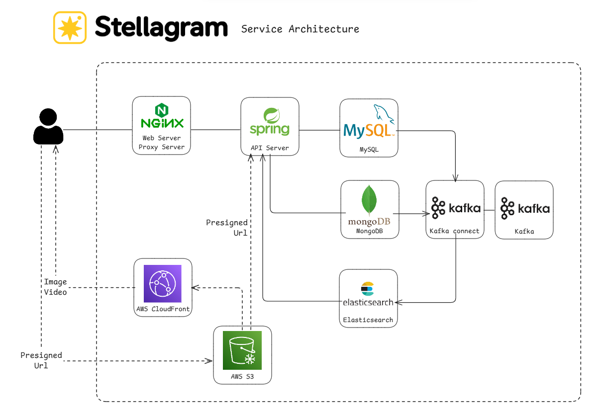
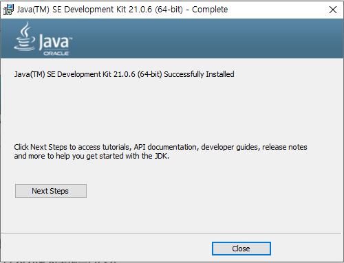
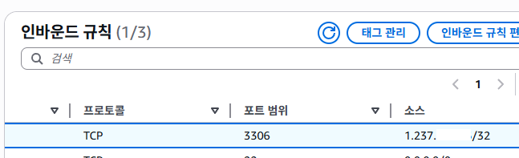
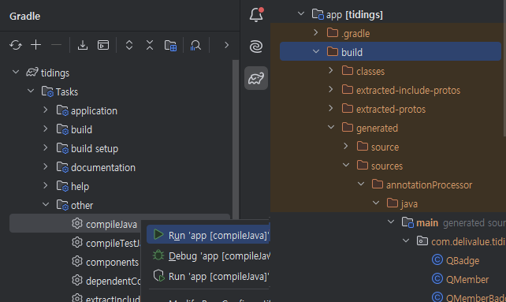

# Service Architecture



# ERD, Data Structure

## MySQL Database


## MongoDB Database

<details>
<summary><h3>Post Document 설계 고민</h3></summary>
<div markdown="1">


```ts
/*
1. post에 userName, profileImage와 badge를 포함하는 것이 좋을까?
2. userId만 가지고 현재 해당 유저의 userName, profileImage, badge를 가져오도록 하는 것이 좋을까?

1번의 경우 추가적인 Disk I/O 없이 포스트의 모든 정보를 가져올 수 있다는 장점이 있다.
2번의 경우 언제든 포스트를 작성한 유저의 최신 유저 정보를 가져올 수 있다는 장점이 있다.

만약 post에 user_name, profile_image, badge를 포함한다면 해당 유저가 정보를 바꿨을 때는 어떻게 처리하지?
  - post를 읽을 때 마다 유저의 현재 정보를 가져오는 횟수보다 유저가 정보를 바꿨을 때 post들을 탐색해서 정보를 바꿔주는게 더 좋을 것 같음
    - 더군다나 이전 post의 정보를 바꾸는 작업은 즉시 반영이 되지 않아도 괜찮고, 결과적 일관성을 지키기만 하면 될 것 같으니 작업 서버에서 이벤트 기반으로 처리하는 것도 좋을 듯

그러면 post에 유저 정보를 저장하고, post를 저장할 NoSQL DB를 disk에서 정렬하여 저장하는 DB로 선택해야 성능 상 좋을 것 같다.
*/
```

서비스가 프로필에서 이름과 뱃지 등 많은 것을 변경할 수 있기 때문에

이전에 작성된 포스트라도 가장 최신의 유저 정보를 표현할 수 있어야 하는데,

포스트에 포함될 유저 정보를 어떤 식으로 관리하는 것이 좋을까? 라는 고민이 있었고

유저 정보를 매 번 추가적으로 가져오는 요청 횟수가 유저 정보를 변경했을 때 해당 유저의 모든 포스트에서 정보를 바꾸는 비용보다 많을 것으로 예상했습니다.

그래서 포스트를 가져올 때는 해당 유저의 정보를 모두 포함하도록 데이터 저장 구조를 결정했습니다.

</div>
</details>


```
Post
{
	id: String 
	internalUserId: String 
	userId: String 
	userName: String  
	profileImage: String  
	badge: {
		id: Integer
		name: String
		url: String
	}
	createdAt: LocalDateTime
	content: {
		String text; 
		media: List<{
			type: String
			url: String
		}>;  
		tag: List<String>;
	}
	commentCount: Integer
	likeCount: Integer
	scrapCount: Integer
	isOrigin: boolean
	
	//Required when isOrigin false
	originalPostId: String
	originalUserId: String
}
```

```
Comment
{
    id: ObjectId

    postId: String
    userId: String
    internalUserId: String
    userName: String
    profileImage: String
    text: String
    badge: {
		id: Integer
		name: String
		url: String
	};
    createdAt: LocalDateTime
    deletedAt: LocalDateTime

    isRoot: boolean
    rootCommentId: ObjectId
}
```


```
Feed
{
  id: ObjectId;
  
  internalUserId: String
  postId: String
  createdAt: LocalDateTime //Spring Data MongoDB에서 ISODate로 변환
  expiredAt: Date //명시적으로 Date 할당
}
```

# 개발 과정


<details>
<summary><h2>1. JDK 설치하기</h2></summary>
<div markdown="1">


## JDK21 다운로드 하기

Java의 버전은 Virtual Thread를 사용할 수 있는 21 버전을 채택하기로 결정했습니다.(결국 현재까지 안씀..)


https://www.oracle.com/kr/java/technologies/downloads/#java21

원래는 OS의 레지스터 사양이 나뉘어 있다면 사양에 맞게 설치해야겠지만, x64만 존재하는 관계로 x64 Installer를 통해 개발용 윈도우 PC에 설치하도록 하겠습니다.




## 환경변수 설정하기

이후 Window 환경 변수에서 시스템 변수 편집을 통해 JAVA_HOME이라는 변수 이름과 변수 값으로 JDK 21을 설치한 위치로 등록해줬습니다.


그 뒤 실질적으로 어떤 위치에서도 java 명령어를 인식할 수 있도록 시스템 변수의 Path에 앞서 등록한 JAVA_HOME 및 하위 bin 디렉토리를 등록해줬습니다.


## 결과

잘 설치되었는지 확인하니 문제 없이 인식하는 것을 볼 수 있었습니다.


</div>
</details>

<details>
<summary><h2>2. Spring 프로젝트 생성하기</h2></summary>
<div markdown="1">


## 프로젝트 설정하기

https://spring.io/quickstart 를 참조하여 프로젝트를 생성하기 시작했습니다.

https://start.spring.io/ 페이지로 유도되어 프로젝트를 간단하게 UI로 생성할 수 있었는데, 아래와 같이 설정하여 프로젝트를 생성하기로 했습니다.


Java 버전은 JDK를 설치할 때 Virtual Thread를 활용할 수 있으면 좋겠다고 생각했기 때문에 21로 결정했었고, Spring 설정에서도 동일하게 21 버전을 명시해줬습니다.

가장 고민되었던 것은 Project Build Tool에 대한 설정이었는데, 두 빌드 도구 모두 학습한 뒤 결정할까 했지만, 학습과 구현의 비중이 현재는 너무 학습에 치우쳐져있다고 생각해 기존 학습 블로그를 참고하여 결정하였습니다.

https://dev-coco.tistory.com/65

### 빌드 도구로 Gradle을 선택한 이유

```
Maven의 특징
  - XML 사용
  - 메이븐은 네트워크를 통해 연관된 라이브러리까지 같이 업데이트를 수행한다.

Gradle의 특징
  - DSL 선행 학습이 필요
  - Maven보다 빌드 속도가 빠름 (캐시 및 병렬 처리)
```

최근 추세는 Maven보다는 Gradle을 통해 빌드하는 것이라고 합니다.

저 또한 DSL 선행 학습이 필요하더라도, 더 빠른 빌드가 의미있다고 생각하기 때문에, 또한 점점 XML 사용을 줄여나가는 것이 추세이기 때문에 Gradle을 사용하기로 결정했습니다.

참고로 사용한 Gradle 버전은 8.13이며 Groovy DSL입니다.

### 의존성 추가


Spring Boot로 프로젝트를 생성하기 전에 의존성을 추가할 수 있었는데,

프로젝트에서 제공할 기능 및 DB가 Spring Framework 프로젝트 생성 이전에 윤곽을 잡아놓고 시작했기 때문에 필요한 기능을 우선 추가하고,

필요에 따라 이후에 추가하거나, 만약 결과적으로 사용하지 않기로 결정했다면 제거하는 방향으로 개발하겠습니다.

따라서 추가된 의존성은 아래와 같습니다.


## 프로젝트 생성하기

이후 Spring Initializr를 통해 생성된 압축된 템플릿을 압축 해제 해줬습니다.


이후 gradlew.bat을 bootRun으로 실행했을 때 정상적으로 동작하는 것을 확인할 수 있었습니다.


## 개발 편의성을 위한 DevTool 적용

Spring Boot로 프로젝트를 생성할 때 개발 편의성을 위한 Spring Boot Dev Tools 의존성을 함께 추가하였었습니다.

```gradle
// build.gradle

dependencies {
	developmentOnly 'org.springframework.boot:spring-boot-devtools'
...
}
```

정확히 제가 원하는 기능은 Hot Reload를 통한 개발 편의성 증가였고, 해당 기능을 이용하기 위해 추가로 설정해줘야 하는 Setting이 있었습니다.

### Enable Build Project automatically

첫 번째로 Settings/Build, Execution, Deployment/Compiler에 있는 설정 중 하나인 Build Project automatically입니다.


### Allow auto-make to start even if developed application is currently running

두 번째로 Settings/Advanced Setting에 있는 Allow auto-make to start even if developed application is currently running 설정을 허용하는 것이었습니다.


결과적으로 의존성을 추가하고, 위 두 설정을 허용함으로써 정상적으로 Hot-Reload 기능이 동작함을 확인할 수 있었습니다.

</div>
</details>


<details>
<summary><h2>3. 프로젝트 디렉토리 구조 설계</h2></summary>
<div markdown="1">


프로젝트를 만들며 고민했던 디렉토리 구조는 크게 2가지입니다.

- 계층형 구조와
- 도메인형 구조

## 계층형 구조

```
└── src
    ├── main
    │   ├── java
    │   │   └── com
    │   │       └── delivalue
    │   │           └── tidings
    │   │               ├── TidingsApplication.java
    │   │               ├── config
    │   │               ├── controller
    │   │               ├── dao
    │   │               ├── domain
    │   │               ├── exception
    │   │               └── service
    │   └── resources
    │       └── application.properties
```

## 도메인형 구조

```
└── src
    ├── main
    │   ├── java
    │   │   └── com
    │   │       └── delivalue
    │   │           └── tidings
    │   │               ├── TidingsApplication.java
    │   │               ├── post
    │   │               │   ├── controller
    │   │               │   ├── domain
    │   │               │   ├── exception
    │   │               │   ├── repository
    │   │               │   └── service
    │   │               ├── comment
    │   │               │   ├── controller
    │   │               │   ├── domain
    │   │               │   ├── exception
    │   │               │   ├── repository
    │   │               │   └── service
    │   │               └── auth
    │   │                   ├── controller
    │   │                   ├── domain
    │   │                   ├── exception
    │   │                   ├── repository
    │   │                   └── service
    │   └── resources
    │       └── application.properties

```


사실 이전 JavaScript 프로젝트들을 진행하면서 두 가지 구조에 대한 경험을 할 수 있었는데,

결과적으로 저는 이번 프로젝트에서 도메인형 디렉토리 구조를 사용할 예정입니다.

지난 프로젝트에서 계층형 구조를 사용하며 느꼈던 불편함은

`Controller` 또는 `Service` 계층 등.. 서비스의 기능이 많아질 수록 해당 디렉토리의 내부 파일이 필수불가결하게 늘어날 수 밖에 없고, 자연스레 복잡도가 높아지는 것을 느꼈기 때문입니다.

그에 반해 도메인형 자료 구조는 기능이 늘어나더라도 해당 도메인 디렉토리가 한 개 생겨 그 안에 도메인을 구성하는 기능이 밀집되어 더 접근하기 편하다고 생각했습니다.

</div>
</details>


<details>
<summary><h2>4. 회원가입 및 로그인</h2></summary>
<div markdown="1">

<details>
<summary><h3>4-1. 구글 OAuth 등록 및 Spring Security 설정</h3></summary>
<div markdown="1">


## Google Cloud OAuth Client 등록

이번 프로젝트에선 사용자에게 Google OAuth를 이용한 로그인만 지원할 예정입니다.


따라서 Google Cloud에 새로운 프로젝트를 생성해줬고,

웹 애플리케이션의 클라이언트를 새롭게 등록해주었습니다.


현재는 JavaScript를 제공할 위치와 이를 처리할 API 서버 모두 개발단계이기 때문에 `localhost` 주소로 등록했지만, 추후에는 인스턴스의 public IP를 등록한 도메인으로 대체할 예정입니다.

이후 발급된 client ID 및 Secret은 Github같은 원격 저장소에 올라가면 위험하기 때문에 개발 환경 (윈도우)에서 안전하게 사용할 수 있도록 환경 변수에 등록해줬습니다.


## Spring Security And OAuth2-Client 적용

한 편 API 서버에서는 Spring에서 보다 쉬운 OAuth 적용을 위해 build.gradle에 `Spring Security`와 `OAuth2-Client`를 포함해줬고,

```gradle
// app/build.gradle

dependencies{
	implementation 'org.springframework.boot:spring-boot-starter-oauth2-client'  
implementation 'org.springframework.boot:spring-boot-starter-web'
```

이를 실제로 적용할 수 있도록 Spring Security 설정으로 Google OAuth2 및 OIDC (OpenId Connect)를 이용할 수 있도록 아래와 같이 값을 설정해줬습니다.

```yml
# application.yml
spring:
  security:
    oauth2:
      client:
        registration:
          google:
            client-id: ${GOOGLE_CLIENT_ID}
            client-secret: ${GOOGLE_CLIENT_SECRET}
            scope: "openid, profile, email"
            redirect-uri: "{baseUrl}/login/oauth2/code/{registrationId}"
            authorization-grant-type: "authorization_code"
```

원래는 registration 설정 외에도 provider 설정을 따로 해줘야하지만,

Google, Facebook, Github처럼 유명한 3자 리소스 서버는 Spring 레벨에서 Auto Configuration을 지원하여 따로 작성하지 않아도 됐습니다.

여기서 문제가 될 수 있는 부분이

기본적으로 Spring Security의 `OAuth2LoginAuthenticationFilter`가  `/login/oauth2/code` 경로로 redirect uri 매칭을 수행하고 인증에 성공하면 루트 경로`/` 로 보내기 때문에

원하는 경로로 Redirection할 수 있도록 `SecurityFilterChain`을 수정해야 했습니다.

```java
//package com.delivalue.tidings.config;

@Configuration
public class SecurityConfig {

    @Bean
    public SecurityFilterChain securityFilterChain(HttpSecurity http) throws Exception {
        http
                .csrf((csrf) -> csrf.disable())
                .authorizeHttpRequests((requests) -> requests
                        .requestMatchers("/oauth2/authorization/**").authenticated()
                        .requestMatchers("/auth/**").authenticated()
                        .anyRequest().permitAll()
                )
                .oauth2Login((login) -> login
                        .defaultSuccessUrl("/signInEvent.html")
                );
        return http.build();
    }
}
```

Spring Security에선 기본적으로 POST, PUT, DELETE같은 상대 변경 요청에 대해 CSRF 토큰을 검증하도록 enable 되어 있지만,

저는 모든 인증을 서버에서 발급한 AccessToken으로 수행할 예정이기 때문에 CSRF 설정을 Disable로 변경하였고,

대신 `/auth` 경로로 들어오는 모든 요청에 대해선 Spring Security가 지원하는 JSESSIONID로 매핑된 유저 정보를 통해 자격 증명이 완료되었는지 확인할 수 있도록 `.requestMatchers("/auth/**").authenticated()`를 추가하였습니다.

## CORS 문제 해결

Spring Web MVC 설정에서 `WebMvcConfigurer`에 대한 Bean을 등록하며 CORS를 설정해줬기 때문에 문제가 없을 것으로 생각했던 것과 달리

실제로는 충분하지 않았고, Spring Security 설정에서도 CORS 허용을 추가해줘야 했습니다.

```java
public class SecurityConfig {

    @Bean
    public UrlBasedCorsConfigurationSource corsConfigurationSource() {
        CorsConfiguration configuration = new CorsConfiguration();
        configuration.setAllowedOriginPatterns(List.of(("http://localhost:5173")));
        configuration.setAllowedMethods(List.of("GET"));

        UrlBasedCorsConfigurationSource source = new UrlBasedCorsConfigurationSource();
        source.registerCorsConfiguration("/**", configuration);

        return source;
    }
}
```


</div>
</details>


<details>
<summary><h3>4-2. MySQL용 AWS EC2 인스턴스 생성</h3></summary>
<div markdown="1">


## EC2 인스턴스 생성하기


기본적으로 프리티어는 30GiB의 EBS 용량까지 무료로 이용할 수 있기 때문에 30GiB의 저장 용량을 가진 t2.micro 모델을 선택하였습니다.

## 기타 리눅스 설정

### SSH 접속을 위한 .pem 권한 변경

SSH 접속 위치가 리눅스, 또는 git bash라면 .pem key를 chmod 400으로 쉽게 변환하여 사용할 수 있지만,

윈도우의 경우 chmod를 지원하지 않으니 아래 명령줄을 순서대로 입력하여 권한을 변경해줬습니다.

```cmd
> icacls.exe tidings-mysql-first.pem /reset

> icacls.exe tidings-mysql-first.pem /grant:r %username%:(R)

> icacls.exe tidings-mysql-first.pem /inheritance:r
```

이후 ssh로 접속이 잘 되는 것을 확인했습니다.

```bash
ssh -i "tidings-mysql-first.pem" ec2-user@[IP]
```

### SSH 비밀번호 접근 차단

어디서 인스턴스에 접근해야 할지 모르기 때문에 22번 Port로의 접근을 AnyWhere (0.0.0.0/0)으로 설정해야 합니다.

따라서 브루트포스 공격을 막기 위하여 비멀번호를 통한 접근을 방지하려고 합니다.

```
sudo nano /etc/ssh/sshd_config
```

sshd_config를 수정할 수 있도록 nano로 열어줬고

```
PasswordAuthentication no
```

내리다 보면 볼 수 있는 `PasswordAuthentication`을 `no`로 설정해줬습니다.

다만 AMI를 Amazon Linux로 설정했을 경우에는 처음부터 no 설정이 되어있었습니다.

### SSH 재시작

이후 적용했던 모든 SSH 설정을 반영하기 위하여 sshd를 재시작해줬습니다.

```
sudo systemctl restart sshd
```

### pem키 없이 SSH 접속 설정

1.  로컬에서 SSH키 생성

```bash
ssh-keygen -t rsa -b 4096 -C "delivalue100@gmail.com"
```

2. 생성 위치에서 공개키 (.rsa.pub) 서버로 등록

윈도우에선 번거롭기 때문에 git bash를 이용했습니다.

```bash
cat id_rsa.pub | ssh -i [.pem key 위치] ec2-user@[IP] 'mkdir -p ~/.ssh && cat >> ~/.ssh/authorized_keys && chmod 600 ~/.ssh/authorized_keys'
```

3. 접속 확인

```
ssh ec2-user@[IP]
```

정상적으로 접속이 잘 되는 것을 확인할 수 있었습니다.

## MySQL 설치

제가 EC2 인스턴스를 생성할 때 선택했던 AMI는 Amazon Linux였는데,

Amazon Linux는 Red  hat 계열 Linux라서 기본적으로 내장되어 있는 패키지 관리자로 install을 진행하는 경우 MySQL 대신 MariaDB를 제공했습니다.

따라서 `wget`을 통해 MySQL을 직접 받아오고,

```bash
sudo wget https://dev.mysql.com/get/mysql80-community-release-el9-1.noarch.rpm
```

받아온 MySQL을 패키지 관리자 명령어로 설치 가능한 패키지에 등록하는 작업을 수행하였습니다.

```bash
sudo dnf install -y mysql80-community-release-el9-1.noarch.rpm

sudo dnf update -y
```

이후 등록한 패키지를 설치할 수 있었습니다.

```
sudo dnf install -y mysql-community-server
```

## mysqld 실행 및 인스턴스 부팅 시 자동 실행 등록

mysqld를 실행하는 것은 간단하게 아래 명령어를 통해 수행했고,

```bash
sudo systemctl start mysqld
```

이후 부팅 시 자동으로 mysqld가 실행될 수 있도록 설정해줬습니다.

```bash
sudo systemctl enable mysqld
```

## 보안그룹 설정

mysqld가 실행되는 3306 포트를 모든 IP에서 접근하면 위험할 수 있기 때문에

API 서버의 IP주소, 현재는 개발 단계이기 때문에 개발을 진행하는 PC의 IP주소로만 인바운드 할 수 있도록 등록했습니다.



</div>
</details>

<details>
<summary><h3>4-3. MySQL 유저 테이블 만들기</h3></summary>
<div markdown="1">


## MySQL 유저 생성

Amazon Linux에서 MySQL을 처음 접근하려면 root 계정의 임시 비밀번호를 알아야 합니다.

```bash
sudo grep 'temporary password' /var/log/mysqld.log
```

위 명령어를 입력했을 때 임시 비밀번호가 나온다면 해당 비밀번호를 root계정으로 mysql 클라이언트를 접속했을 때 사용하면 됩니다.

```bash
mysql -u root -p
```

처음 root 계정으로 mysql에 접속하면 `password_expired = Y`설정 때문에 root 계정의 비밀번호를 변경해야만 다른 계정을 만들 수 있었습니다.

따라서 우선적으로 root 계정의 비밀번호를 정책에 맞게 변경해줬습니다.
- 대문자 + 소문자 + 숫자 + 특수문자
- 8자 이상

만약 복잡한 비밀번호 정책이 불편하다면  `SET GLOBAL validate_password.policy = LOW;` 및 `SET GLOBAL validate_password.length = 6;`처럼 기준을 변경할 수 있지만, 저는 그대로 사용할 예정입니다.

```bash
ALTER USER 'root'@'localhost' IDENTIFIED BY [PW];
```


이후 mysql 클라이언트로 접속했을 때 CREATE USER 명령어를 통해 유저를 생성할 수 있습니다.

```
CREATE USER 'tidings_api'@'%' IDENTIFIED BY [password];
```

참고로 `%`위치에는 `localhost`,  `%`, `특정 아이피`가 포함될 수 있는데 아래 의미로 사용됩니다.
- localhost: localhost에서만 접근할 수 있는 계정
- %: 와일드카드로써 와일드카드에 매칭되는 모든 호스트에서 접근할 수 있는 계정
- 특정 아이피: 특정 아이피만 접근할 수 있는 계정

이 계정의 경우 API 서버에서 접근할 수 있도록 만들 예정이기 때문에 와일드카드로 지정했습니다.

## MySQL DB 및 TABLE 생성


우선 `user` 라는 키워드는 MySQL에서 예약어이기 때문에 `member` 테이블로 이름을 결정했고,

유저 정보를 포함하여 필요한 badge, member_badge 테이블을 함께 설계해줬습니다.

```sql
>mysql
CREATE DATABASE IF NOT EXISTS tidings_service;

USE tidings_service;

CREATE TABLE badge (
  id INT AUTO_INCREMENT,
  name VARCHAR(255) NOT NULL,
  url VARCHAR(255) NOT NULL,
  created_at TIMESTAMP NOT NULL,
  PRIMARY KEY (id)
);

CREATE TABLE member (
  id VARCHAR(100) NOT NULL,
  badge_id INT NULL,
  public_id VARCHAR(15) NOT NULL,
  name VARCHAR(20) NOT NULL,
  bio VARCHAR(255) NOT NULL,
  profile_image VARCHAR(255) NOT NULL,
  email VARCHAR(255) NULL,
  following_count INT NOT NULL,
  follower_count INT NOT NULL,
  created_at TIMESTAMP NOT NULL,
  deleted_at TIMESTAMP NULL,
  PRIMARY KEY (id),
  UNIQUE (public_id),
  FOREIGN KEY (badge_id) REFERENCES badge(id)
);

CREATE TABLE member_badge (
  id INT AUTO_INCREMENT,
  member_id VARCHAR(100) NOT NULL,
  badge_id INT NOT NULL,
  created_at TIMESTAMP NOT NULL,
  PRIMARY KEY (id),
  FOREIGN KEY (member_id) REFERENCES member(id) ON DELETE CASCADE,
  FOREIGN KEY (badge_id) REFERENCES badge(id) ON DELETE CASCADE,
);
```

이후 root 계정을 통해 DB 및 TABLE을 함께 만들어줬습니다.


## 유저 권한 부여

TABLE은 root 계정으로 만들었지만, 실제 접근은 다른 계정으로 외부에서 접근해야 하기 때문에

만든 `tidings_service` 데이터베이스의 모든 권한을
외부에서 접근할 `'tidings_api'@'%'` 계정에 부여한 뒤 반영했습니다.

```bash
-- 권한 부여
GRANT ALL ON tidings_service.* TO 'tidings_api'@'%';

# Kafka Connect 용도
GRANT RELOAD, FLUSH_TABLES, REPLICATION SLAVE, REPLICATION CLIENT ON *.* TO 'tidings_api'@'%';

-- 변경된 설정 반영
FLUSH PRIVILEGES;
```


</div>
</details>

<details>
<summary><h3>4-4. 데이터 접근 설정</h3></summary>
<div markdown="1">


## Entity 및 Repository 정의

```
```gradle
// build.gradle

dependencies {
	implementation 'org.springframework.boot:spring-boot-starter-data-jpa'
	runtimeOnly 'com.mysql:mysql-connector-j'
	...}
```

가장 먼저 data-jpa와 mysql을 이용할 예정이기 때문에 mysql-connector-j를 의존성에 추가해줬고,

```java
@Entity
@Getter
@Builder
public class Member {
    @Id
    private String id;

	@OneToOne(fetch = FetchType.LAZY, optional = true)  
	@JoinColumn(name = "badge_id")  
	private Badge badge;

    @Column(name = "public_id")
    private String publicId;

    private String name;

    private String bio;

    @Column(name = "profileImage")
    private String profileImage;

    private String email;

    @Column(name = "following_count")
    private int followingCount;

    @Column(name = "follower_count")
    private int followerCount;

	@Column(name = "created_at")  
	private LocalDateTime createdAt;  
	  
	@Column(name = "deleted_at")  
	private LocalDateTime deletedAt;
}
```

Member에 대한 매핑이 올바르게 이어질 수 있도록 미리 생성한 테이블의 컬럼과 동일한 이름으로 Entity를 만들어줬습니다.

이 때 각 속성에 대한 Getter 정의를 간편하게 할 수 있도록 Lombok의 @Getter 애노테이션을 이용하였고, 로직을 통한 데이터 제어 및 데이터 무결성을 위해 `@Setter 대신 @Builder`를 적용했습니다.

```java
//package com.delivalue.tidings.domain.data.repository.MemberRepository;

@Repository
public interface MemberRepository extends JpaRepository<Member, String> {

    Member findByPublicId(String publicId);
}
```

Spring Data JPA는 인터페이스만 정의하면 구현체는 자동으로 생성해주는 기능을 제공하기 때문에 데이터에 접근하는 Repositorty는 Interface로 작성하였습니다.

## DataSource 자동 연결 방지 제거

정작 잘 작동할 줄 알았는데 서버 애플리케이션을 실행했더니 아래와 같은 문구가 발생하며 애플리케이션 실행이 안되었습니다.

```
Parameter 0 of constructor in com.delivalue.tidings.domain.auth.service.AuthService required a bean of type 'com.delivalue.tidings.domain.data.repository.MemberRepository' that could not be found.
```

내용은 즉 Repository가 Bean으로 등록되지 않아 IoC컨테이너에 의해 DI되지 못했다는 내용인데, 소스 코드 상 MemberRepository는 JpaRepository를 잘 상속받아 문법에는 문제가 없는 것으로 확인되었기 때문에 문제 원인 파악이 필요했습니다.

```
spring:
  autoconfigure:
    exclude: org.springframework.boot.autoconfigure.jdbc.DataSourceAutoConfiguration
```

알고 보니 이전에 DB 연결 이전에 자동으로 연결하는 옵션 때문에 앱을 실행시킬 수 없었어서 추가했던 자동 연결 방지 옵션이


</div>
</details>


<details>
<summary><h3>4-5. 회원가입 로직</h3></summary>
<div markdown="1">


## 회원 여부 조회 및 회원 가입 유도

Google의 OAuth2.0 및 OpenID를 이용해 3자 리소스 서버의 정보를 가져온 이후 우리 서버의 형식에 맞게 내부 식별용 ID를 조합한 뒤, 해당 ID로 유저가 존재하는지 확인하였습니다.

```java
//package com.delivalue.tidings.domain.auth.controller;

public class AuthController {

	@GetMapping("/login")  
	public Map<String, Object> continueWithGoogle(@AuthenticationPrincipal OAuth2User principal) {
		...
		String expectId = "google" + "@" + resource.get("sub");  
		boolean isUserExist = authService.checkUserExist(expectId);
		if(isUserExist) {...}
		else {  
		    response.put("result", "register");  
		}
		
		return response;
}
```

만약 유저가 존재하지 않는다면 `result`의 반환 값으로 `register`를 전달함으로 클라이언트에서 회원 가입 컴포넌트가 렌더링될 수 있도록 구현하였는데,

제가 지향하는 바이자, 생각했던 것은

유저가 "정말 간단한 과정"만을 거쳐 서비스를 이용할 수 있어야 유저 경험이 좋을 것으로 생각했습니다.

따라서 회원가입에 필요한 것은

1. 구글로 로그인하기
2. 유저 식별용 ID를 직접 결정하기

단 두 가지 과정만으로 회원 가입을 수행할 수 있도록 구현하려고 합니다.

## 유저 식별용 ID 확인 로직

클라이언트에서 회원 가입 컴포넌트가 렌더링되면 유저는 식별용 ID를 입력해야 하는데,

이 또한 회원가입의 과정이므로 `auth/check?id=userId` 경로로 유저 식별용 ID가 존재하는지, 즉 사용자가 사용할 수 있는지 결과를 반환하도록 결정했습니다.

```java
//package com.delivalue.tidings.domain.auth.controller;

public class AuthController {
	...
	@GetMapping("/check")  
	public PublicIdValidateResponse checkPublicId(@RequestParam(value = "id") String publicId) {  
	    return authService.checkPublicIdUsable(publicId.trim());  
	}
}
```

이 때 고민한 것은 체크할 publicId, 즉 자원을 경로로 넣을지, 쿼리에 넣을지 결정하는 것이었습니다.

결과적으로 저는 최대한 REST 원칙에 맞게 `"자원의 식별"에는 경로(Path), "자원의 필터링/조건"에는 쿼리(Query Parameter)를 사용하자` 라는 일관된 기준을 가지고자 했으며,

checkPublicId는 "id가 존재하는지"의 검색 조건을 포함하기 때문에 쿼리로 자원을 표현하도록 했습니다.


checkPublicId의 반환 값은 `PublicIdValidateResponse`로 사용 가능 여부를 전달하기 위해 설계한 DTO 입니다.

```java
//package com.delivalue.tidings.domain.auth.dto;

public class PublicIdValidateResponse {
    private boolean result;
    private String statusMessage;

    public PublicIdValidateResponse(String expectId) {
        this.validate(expectId);
    }

    private void validate(String expectId) {
        Pattern publicIdPattern = Pattern.compile("^[A-Za-z0-9_]+$");
        boolean isOverRangeString = expectId.length() < 4 || expectId.length() > 15;
        boolean isSupportCharacter = publicIdPattern.matcher(expectId).matches();

        if (isOverRangeString) {
            this.result = false;
            this.statusMessage = "overRangeString";
        }

        if (!isSupportCharacter) {
            this.result = false;
            this.statusMessage = "noSupportCharacter";
        }

        if(!isOverRangeString && isSupportCharacter) {
            this.result = true;
            this.statusMessage = "enableId";
        }
    }
}
```

`PublicIdValidateResponse`에선 인스턴스를 생성할 때 요청으로 발생한 데이터를 자체적으로 검증하고, 외부에서 내부 속성을 변경할 수 있도록 lombok의 @Setter를 적용했습니다. (위 코드엔 제외하여 기록)

정확히는 유저 식별용 ID를 2가지로 분류하여 검증하는데,

- 데이터베이스를 조회해야 검증할 수 있는 부분 (이미 존재하는지)과,
- 서비스에서 설계한 유저 식별용 아이디 규격과 일치하는지

위 코드에서 `validate`는 유저 식별용 아이디 규격과 일치하는지를 검사합니다.

이외의 데이터베이스 조회 후 검증의 경우는 AuthService 컴포넌트에서 데이터베이스 조회 이후 검증을 수행하도록 구현하였습니다.

```java
//package com.delivalue.tidings.domain.auth.service;

@Service
public class AuthService {
	...
    public PublicIdValidateResponse checkPublicIdUsable(String publicId) {
        PublicIdValidateResponse response = new PublicIdValidateResponse(publicId);

        if(ForbiddenWordFilter.containsForbiddenWord(publicId)) {
            response.setResult(false);
            response.setStatusMessage("disableId");
        }

        if(response.isResult()) {
            Member member = memberRepository.findByPublicId(publicId);
            if(member != null) {
                response.setResult(false);
                response.setStatusMessage("alreadyTaken");
            }
        }

        return response;
    }
}
```

사실 이 때 데이터베이스를 조회하여 검증하는 부분을 제외한 나머지는 클라이언트에서도 동일하게 서버에 전송하기 이전에 검증하는 과정이긴 하지만,

클라이언트는 변조의 가능성이 있기 때문에 모든 책임을 클라이언트에게 지지 않도록 하였고,

대신 클라이언트는 디바운싱과 더불어 자체 검증에 실패하면 서버로 API 요청을 하지 않도록 구현하여

클라이언트의 코드 변조가 없다는 가정 하에 API 호출량을 줄여 서버의 정상적인 처리량을 확보하도록 하였습니다.

추가로 유저 식별용 ID 조회는 빈번하게 발생할 수 있고, 기본키도 아니기 때문에 MySQL에서 인덱스를 생성해줬습니다.

```SQL
mysql> CREATE INDEX idx_public_id ON member(public_id);
```

## 유저 정보 가공


```java
//package com.delivalue.tidings.domain.auth.controller;

@RestController  
@RequestMapping("/auth")
public class AuthController {
	...
    @PostMapping("/register")
    public ResponseEntity<Map<String, Object>> register(OAuth2AuthenticationToken authToken, @AuthenticationPrincipal OAuth2User principal, @RequestBody Map<String, String> body) {
        String publicId = body.get("publicId");
        PublicIdValidateResponse validateResult = authService.checkPublicIdUsable(publicId);
        Map<String, Object> resource = principal.getAttributes();

        if(validateResult.isResult() && resource != null) {
            String registrationId = authToken.getAuthorizedClientRegistrationId();
            String internalId = registrationId + "@" + resource.get("sub");
            RegisterRequest newMemberData = new RegisterRequest(internalId, publicId, resource.get("name").toString(), resource.get("email").toString());

            try {
                authService.registerMember(newMemberData);
            } catch (Exception e) {
                return ResponseEntity.internalServerError().build();
            }

            return ResponseEntity.ok(new HashMap<>()); //TODO: LoginResponse dto
        }
        else return ResponseEntity.badRequest().build();
    }
}
```

## 데이터베이스 유저 삽입

데이터를 삽입하기 위해 회원가입을 위한 DTO 클래스인 `RegisterRequest`를 만들었습니다.

```java
//package com.delivalue.tidings.domain.auth.dto;

public class RegisterRequest {
    ...
    public RegisterRequest(String internalId, String publicId, String name, String email) {
        this.internalId = internalId;
        this.publicId = publicId;
        this.name = name;
        this.email = email;
    }

    public Member toEntity() {
        return Member.builder()
                .id(this.internalId)
                .publicId(this.publicId)
                .name(this.name)
                .bio("")
                .profileImage("") //default profile image
                .badge(null)
                .email(this.email)
                .followerCount(0)
                .followingCount(1) //stellagram official
                .createdAt(LocalDateTime.now(ZoneId.of("Asia/Seoul")))
                .deletedAt(null)
                .build();
    }
}
```

`RegisterRequest`는 유저가 가입을 위해 전달하는 publicId를 전달받아, Spring Security에서 세션으로 저장하는 토큰 정보 및 유저 정보를 통해

Controller 레이어에서 생성하여 Service 레이어로 전달하며, DTO 내부에 Entity로 변환하는 함수를 만들어 Repository로 삽입 동작을 수행할 수 있도록 하였습니다.

```java
//package com.delivalue.tidings.domain.auth.service;

@Service
public class AuthService {
	...
    public void registerMember(RegisterRequest newMemberData) {
        Member memberEntity = newMemberData.toEntity();
        memberRepository.save(memberEntity);
    }
}
```

</div>
</details>


<details>
<summary><h3>4-6. AccessToken과 RefreshToken 발급</h3></summary>
<div markdown="1">


## JWT를 이용한 토큰 발급

JWT로 AccessToken과 RefreshToken을 만드는 것은 동일하지만,

토큰 발급 방식을 RTR (Refresh Token Rotation) 방식으로 할지, 아니면 일반적인 방식으로 수행할지 고민하게 되었습니다.

다만 현재 가용할 수 있는 서버의 성능이 좋지 않은 반면,
만약 RTR 방식으로 토큰을 발급할 경우 가장 최근 발급된 토큰을 추적하고, 이전 토큰들을 무효화할 수 있도록 서버에서 관리해야 했기 때문에 일반적인 Refresh 발급 방식을 택했습니다.

```gradle
// build.gradle

dependencies {
    implementation 'io.jsonwebtoken:jjwt-api:0.12.6'
    runtimeOnly 'io.jsonwebtoken:jjwt-impl:0.12.6'
    runtimeOnly 'io.jsonwebtoken:jjwt-jackson:0.12.6'
	...}
```

JWT, 그 중에서도 JWS 토큰을 쉽게 생성할 수 있도록 외부 의존성을 추가해줬고,

우리 서비스에서 전체적으로 토큰과 관련된 책임을 가질 `TokenProvider` 컴포넌트를 구현해줬습니다.

```java
//package com.delivalue.tidings.common;

@Component  
public class TokenProvider {  
    private final SecretKey key;  
  
    TokenProvider(@Value("${JWT_SECRET_STRING}") String secret) {  
        byte[] keyBytes = Decoders.BASE64.decode(secret);  
        this.key = Keys.hmacShaKeyFor(keyBytes);  
    }  
  
    public String generateJWT(String id, String type) {  
        int expirationTime = type.equals("REFRESH") ? 3600 * 24 * 28 : 3600;  
  
        return Jwts.builder()  
                .subject(id)  
                .issuedAt(new Date())  
                .expiration(new Date(System.currentTimeMillis() + expirationTime))  
                .signWith(this.key)  
                .compact();  
    }  
  
    public String getUserId(String token) {  
        return Jwts.parser()  
                .verifyWith(this.key)  
                .build()  
                .parseSignedClaims(token)  
                .getPayload()  
                .getSubject();  
    }  
  
    public boolean validate(String token) {  
        try {  
            this.getUserId(token);  
            return true;  
        } catch (Exception e) {  
            return false;  
        }  
    }  
}
```

TokenProvider에선 JWT를 이용한 토큰 발급 및 검증을 수행할 수 있도록 구현하였습니다.

JWT를 구성할 땐 대칭키를 사용을 위해 hmac 방식으로 Secret 문자열을 암호화해 SecretKey를 생성하였는데,

이 때 가장 중요하게 생각한 것이 JWT를 구성하는 과정에서 Secret를 어떻게 관리할지에 대한 고민이었는데

1. 만약 외부 환경 변수로 관리한다면 혹시나 보안적인 위협이 있을 수 있다고 생각했고

2. 내부 소스코드에서 서버 애플리케이션 실행 시점 (정확히는 TokenProvider가 Bean으로 등록되는 시점)에 생성된다면 서버 애플리케이션을 재실행할 때 마다 기존 발급되었던 토큰의 검증이 불가능해 UX적으로 안좋을 것 같다고 생각했습니다.

두 가지 고민 끝에 외부 환경 변수로 관리될 수 있도록 구현하고자 했습니다.

## Login 요청 Response DTO 클래스 만들기

```java
//package com.delivalue.tidings.domain.auth.dto;

@Builder
public class LoginResponse {
    private String result;
    private String refreshToken;
    private String accessToken;
}
```

LoginResponse DTO를 만들고, 해당 값을 Controller에서 응답으로 전달했을 때 예상치 못한 문제를 만나게 되었는데,

Response의 Content-Type이 브라우저에서 Accept로 허용하지 않은 값이 전달되어 406 상태 코드가 응답으로 처리된다던가,

application/json으로 응답 타입을 고정했을 때 Content-Type이 null로 변경된다는 등의 문제가 있었고,

원인을 파악한 결과 Spring은 내부적으로 객체를 Jackson으로 직렬화하는데, 이 때 Jackson이 Getter를 통해 값을 직렬화 한다는 것이었고,

앞서 만들었던 LoginResponse는 @Builder 애노테이션만 적용했다는 것이었습니다.

따라서 lombok에서 지원하는 @Getter 애노테이션을 추가해줬습니다.

```java
//package com.delivalue.tidings.domain.auth.dto;

@Getter //<< Getter 추가
@Builder
public class LoginResponse {
    private String result;
    private String refreshToken;
    private String accessToken;
}
```

아래는 LoginResponse DTO 클래스를 이용한 응답

```java
    @GetMapping("/login")
    public ResponseEntity<LoginResponse> continueWithGoogle(...) {
        ...
        boolean isUserExist = authService.checkUserExist(expectId);
        if(isUserExist) {
            response
                    .result("login")
                    .refreshToken(this.tokenProvider.generateJWT(expectId, "REFRESH"))
                    .accessToken(this.tokenProvider.generateJWT(expectId, "ACCESS")).build();

            return ResponseEntity.ok(response.build());
        } else {
            response
                    .result("register")
                    .refreshToken(null)
                    .accessToken(null);

            return ResponseEntity.status(HttpStatus.UNAUTHORIZED).body(response.build());
        }
    }
```

## AccessToken Refresh API

우선 다른 `/auth/**` 경로는 전부 OAuth 2.0을 이용한 로그인 이후의 요청이라는 가정이 있기 때문에 세션 검증이 수행되는 `.authenticated()`를 수행했지만,

토큰 Refresh 같은 경우에는 서버가 재실행 등의 이유로 세션 정보를 잃을 수 있기 때문에 authenticated를 수행하지 않도록 Spring Security filter chain을 수정해줬습니다.

```java
//package com.delivalue.tidings.config;

public SecurityFilterChain securityFilterChain(HttpSecurity http) throws Exception {
	http
		.authorizeHttpRequests((requests) -> requests
			...
			.requestMatchers("/auth/refresh").permitAll()
			.requestMatchers("/auth/**").authenticated()
			...
		)
		...
}
```

중요한 점으로 `authorizeHttpRequests`의 permitAll 또는 authenticated는 먼저 적용한 것이 더 높은 우선순위를 갖게 되기 때문에 `/auth/**`보다 `/auth/refresh`를 우선적으로 호출하도록 했고,

이후 토큰 Refresh를 요청할 수 있는 API를 만들어줬습니다.

```java
//package com.delivalue.tidings.domain.auth.controller;

@RestController
@RequestMapping("/auth")
public class AuthController {
    @GetMapping("/refresh")
    public ResponseEntity<LoginResponse> refresh(@RequestHeader("Authorization") String authorizationHeader) {
        int TOKEN_PREFIX_LENGTH = 7;
        LoginResponse.LoginResponseBuilder response = LoginResponse.builder();

        if(authorizationHeader != null
                && authorizationHeader.startsWith("Bearer ")
                && this.tokenProvider.validate(authorizationHeader.substring(TOKEN_PREFIX_LENGTH))) {
            String id = this.tokenProvider.getUserId(authorizationHeader.substring(TOKEN_PREFIX_LENGTH));

            response
                    .result("refresh")
                    .refreshToken(null)
                    .accessToken(this.tokenProvider.generateJWT(id, "ACCESS"));

            return ResponseEntity.ok(response.build());
        } else {
            response
                    .result("failed")
                    .refreshToken(null)
                    .accessToken(null);

            return ResponseEntity.status(HttpStatus.UNAUTHORIZED).body(response.build());
        }
    }
}
```

refresh까지 구현하다 보니 점점 Controller가 비대해지는 것이 느껴져 기록해뒀다가 추후 단일 책임 원칙을 잘 지키고 있는지 확인하며 리팩토링을 수행해야 할 것 같습니다.

</div>
</details>


</div>
</details>


<details>
<summary><h2>5. 프로필 데이터 처리하기</h2></summary>
<div markdown="1">


## Profile data GET 요청 처리하기

### Profile response dto 클래스 생성

먼저 Profile 데이터를 반환할 DTO 클래스를 만들어줬고,
속성은 클라이언트에서 사용하는 양식대로 선언해줬습니다.

```java
//package com.delivalue.tidings.domain.profile.dto;

@Getter
public class ProfileResponse {
    private final String user_id;
    private final String user_name;
    private final String bio;
    private final String profile_image;
    private final BadgeDto badge;
    private final int following_count;
    private final int follower_count;

    public ProfileResponse(Member member) {
        this.user_id = member.getPublicId();
        this.user_name = member.getName();
        this.bio = member.getBio();
        this.profile_image = member.getProfileImage();
        this.badge = member.getBadge() != null ? new BadgeDto(member.getBadge()) : null;
        this.following_count = member.getFollowingCount();
        this.follower_count = member.getFollowerCount();
    }
}
```

ProfileResponse DTO 클래스를 만들며 주의했던 점은 계층 분리를 위해 속성으로 Entity가 포함되지 않도록 한 것이었는데,

Member Entity 내부엔 Badge Entity가 포함되어 있기 때문에 별도로 BadgeDto 클래스를 만들어 ProfileResponse의 속성으로 포함될 수 있도록 구현하였습니다.

```java
//package com.delivalue.tidings.domain.profile.dto;

@Getter
public class BadgeDto {
    private final String name;
    private final String url;

    public BadgeDto(Badge badge) {
        this.name = badge.getName();
        this.url = badge.getUrl();
    }
}
```

### Controller Layer 정의

프로필 데이터를 반환하는 것은 2가지로 분류했습니다.

첫 번째 방법은 자신의 프로필 데이터를 반환하는 경우로

publicId를 특정할 수 있는 프로필 페이지 방문과는 다르게,

로그인을 수행했을 때 자신의 프로필 정보를 받아와야 하는 경우는 publicId 또한 모르기 때문에 토큰의 userId를 추출해서 데이터를 받아와야 했습니다.

```java
//package com.delivalue.tidings.domain.profile.controller;

@RestController  
@RequestMapping("/profile")  
public class ProfileController {
	...
    @GetMapping
    public ResponseEntity<ProfileResponse> requestMyProfile(@RequestHeader("Authorization") String authorizationHeader) {
        int TOKEN_PREFIX_LENGTH = 7;

        if(authorizationHeader != null
                && authorizationHeader.startsWith("Bearer ")
                && this.tokenProvider.validate(authorizationHeader.substring(TOKEN_PREFIX_LENGTH))) {
            String id = this.tokenProvider.getUserId(authorizationHeader.substring(TOKEN_PREFIX_LENGTH));

            ProfileResponse response = this.profileService.getProfileById(id);

            if(response != null) return ResponseEntity.ok(response);
            else return ResponseEntity.notFound().build();
        }

        return ResponseEntity.status(HttpStatus.UNAUTHORIZED).build();
    }
...
}
```

프로필 정보 반환은 미리 구현되어 있던 `MemberRepository` 클래스를 이용해 Service 레이어에서 publicId로 Member를 찾아줬습니다.

두 번째 방법은 프로필 페이지에 접근했을 때 public Id로 프로필 정보를 반환해야 하는 경우입니다.

```java
//package com.delivalue.tidings.domain.profile.controller;

@RestController  
@RequestMapping("/profile")  
public class ProfileController {
	...
    @GetMapping("/{publicId}")
    public ResponseEntity<ProfileResponse> requestProfile(@PathVariable("publicId") String publicId) {
        ProfileResponse response = this.profileService.getProfileByPublicId(publicId);

        if(response != null) {
            return ResponseEntity.ok(response);
        } else return ResponseEntity.notFound().build();
    }
...
}
```

마찬가지로 미리 구현되어 있던 `MemberRepository` 클래스를 이용해 Service 레이어에서 publicId로 Member를 찾아줬습니다.

```java
//package com.delivalue.tidings.domain.profile.service;

@Service
public class ProfileService {
    public ProfileResponse getProfileById(String internalId) {
        Optional<Member> member = this.memberRepository.findById(internalId);

        return member.isPresent() ? new ProfileResponse(member.get()) : null;
    }

    public ProfileResponse getProfileByPublicId(String publicId) {
        Member member = this.memberRepository.findByPublicId(publicId);

        return member != null ? new ProfileResponse(member) : null;
    }
	...
}
```

## AWS S3 연동하기

API 서버의 S3의 연동 목적은 서버의 부하를 줄이기 위함입니다.

만약 클라이언트에서 프로필 이미지를 변경할 때 서버로 이미지를 보내면

- API 서버는 이미지를 전달받는 Network I/O 리소스 소모
- 파일이 정상적인 이미지인지 검증,
- 다시 S3로 업로드하는 Network I/O 리소스
- 위 과정을 통해 발생하는 네트워크 오버헤드로 클라이언트에게 그만큼 성공적인 응답을 늦게 보내게 되는 등..

위와 같은 문제가 발생할 수 있다고 생각했고,

더군다나 제가 서비스 초기에 운영할 API 서버의 성능으로는 최대한 서버의 부하를 줄이는 것이 가장 중요한 점이기도 했습니다.

따라서 API 서버는 S3와의 연동을 통해 Presigned URL를 발급받아 클라이언트 사이드에서 프로필 이미지를 업로드할 수 있도록 유도하여 서버의 부하를 줄이고자 했습니다.

### AWS S3 Credential 발급

우선 가장 먼저 해준 것은 S3에 접근할 AWS IAM 생성이었습니다.


이번에 생성할 IAM은 S3에 접근하고, Presigned URL을 발급할 목적이기 때문에 AmazonS3FullAccess 권한만 줬습니다.


이후 만들어진 사용자 페이지에 접근해 진짜 목적은 S3 Credential AccessKey를 생성하고자 했습니다.


이후 생성된 AccessKey 및 AccessSecretKey를 각각 `AWS_ACCESS_KEY_ID`, `AWS_SECRET_ACCESS_KEY`라는 이름으로 환경 변수에 추가해줬습니다.

환경 변수 이름을 위처럼 지은 이유는 AWS SDK에서 자동으로 탐색하는 환경 변수의 이름이 위와 동일하기 때문입니다.

### S3 Bucket 정책 및 CORS 설정

```
{
	"Version": "2008-10-17",
	"Id": "PolicyForCloudFrontPrivateContent"
	"Statement": [
		{
			"Sid": "AllowPresignedUrl",
			"Effect": "Allow",
			"Principal": {
			    "AWS": [
			        "arn:aws:iam::{account-id}:root",
			        "arn:aws:iam::{account-id}:user/access-s3"
			    ]
			},
			"Action": "s3:PutObject",
			"Resource": "arn:aws:s3:::tidings-media-storage/*"
		}
...
```

버킷 정책에선 PutObject에 대해 Presigned URL을 발급하는 IAM 사용자와 루트 계정만 PUT 요청을 수행할 수 있도록 정책을 추가하였습니다.

또한 클라이언트에서 직접 S3로 요청하기 때문에 S3 권한 설정 중 CORS 설정도 필요했습니다.

```json
[
    {
        "AllowedHeaders": [
            "*"
        ],
        "AllowedMethods": [
            "PUT"
        ],
        "AllowedOrigins": [
            "*"
        ],
        "ExposeHeaders": [
            "ETag"
        ],
        "MaxAgeSeconds": 1800
    }
]
```

우선은 개발 단계이기 때문에 `AllowedOrigins`를 와일드카드인 `*`로 설정했지만, 추후 배포가 정상적으로 수행되면 `https://stellagram.kr`, `https://*.stellagram.kr`로 변경할 예정입니다.

### AWS S3 SDK v2 의존성 추가

The AWS SDK for Java 1.x는 2024년 7월 31일부터 유지 관리 모드로 전환되어 공식적으로 v2를 추천하기 때문에 v2를 사용하고자 합니다.

```gradle
// build.gradle

dependencies {
	...
    implementation platform('software.amazon.awssdk:bom:2.27.21')
    implementation 'software.amazon.awssdk:s3'
    implementation 'software.amazon.awssdk:s3-presigner'
}
```

`software.amazon.awssdk:bom`은 AWS SDK v2의 모든 라이브러리 버전을 통일시켜주는 BOM(Bill of Materials)

`software.amazon.awssdk:s3`는 S3 파일 업로드, 다운로드, 삭제 등의 주요 기능을 포함한 SDK

`software.amazon.awssdk:s3-presigner`는 Presigned URL 생성을 위한 전용 모듈로써  위 3가지 의존성을 추가해줬습니다.

### Service Layer 정의

S3와 상호작용하여 Presigned URL을 발급할 Service 계층을 먼저 정의하고자 했고,

Service 레이어에선 Controller로부터 AccessToken에서 추출한 Internal Id와 클라이언트에서 요청한 Content-Type을 전달받아 S3 경로를 생성하고 presigned url을 반환하도록 구현했습니다.

```java
//package com.delivalue.tidings.domain.data.service;

@Service
@RequiredArgsConstructor
public class StorageService {
    @Value("${AWS_S3_MEDIA_BUCKET_NAME}")
    private String bucket;
    private final MemberRepository memberRepository;

    public URL getProfilePresignedUploadUrl(String internalId, String contentType) {
        Optional<Member> member = this.memberRepository.findById(internalId);
        if(member.isEmpty()) return null;

        String publicId = member.get().getPublicId();
        String uuid = UUID.randomUUID().toString();
        String path = "profile/" + publicId + "/" + uuid;

        return this.generatePresignedUploadUrl(path, contentType);
    }

    private URL generatePresignedUploadUrl(String path, String contentType) {
        S3Presigner presigner = S3Presigner.builder()
                .region(Region.AP_NORTHEAST_2)
                .credentialsProvider(DefaultCredentialsProvider.create())
                .build();

        PutObjectRequest putObjectRequest = PutObjectRequest.builder()
                .bucket(this.bucket)
                .key(path)
                .contentType(contentType)
                .build();

        PutObjectPresignRequest presignRequest = PutObjectPresignRequest.builder()
                .signatureDuration(Duration.ofMinutes(3))
                .putObjectRequest(putObjectRequest)
                .build();

        PresignedPutObjectRequest presignedPutObjectRequest = presigner.presignPutObject(presignRequest);
        return presignedPutObjectRequest.url();
    }
}
```

중요한 점은 이후 Post를 등록할 때 발급할 Presigned URL 로직을 추가할 때 용이하도록 presigned url을 실질적으로 발급하는 메서드로 `generatePresignedUploadUrl`를 분리했다는 점입니다.

또한, 앞서 생성했던 AWS Credential은 `presigner` 객체를 만드는 과정에서 `DefaultCredentialsProvider.create()`를 수행하면 시스템의 환경변수 중 `AWS_ACCESS_KEY_ID`, `AWS_SECRET_ACCESS_KEY`를 우선적으로 탐색하여 사용합니다.

### Controller Layer 정의

Controller 계층에선 요청의 유효성 검증만을 수행한 뒤 Service 레이어의 응답에 따라 클라이언트로 데이터를 전달해줬습니다.

```java
//package com.delivalue.tidings.domain.data.controller;

@RestController
@RequestMapping("/storage")
@RequiredArgsConstructor
public class StorageController {
    private final StorageService storageService;
    private final TokenProvider tokenProvider;

    @PostMapping("/api/upload/profile")
    public ResponseEntity<Map<String, String>> getProfileUploadUrl(@RequestHeader("Authorization") String authorizationHeader, @RequestBody Map<String, String> body) {
        int TOKEN_PREFIX_LENGTH = 7;
        if(authorizationHeader != null
                && authorizationHeader.startsWith("Bearer ")
                && this.tokenProvider.validate(authorizationHeader.substring(TOKEN_PREFIX_LENGTH))) {
            String id = this.tokenProvider.getUserId(authorizationHeader.substring(TOKEN_PREFIX_LENGTH));

            String contentType = body.get("content-type");
            if(body.isEmpty() || contentType == null) return ResponseEntity.badRequest().build();
            if(!requestValidator.checkImageContentType(contentType)) return ResponseEntity.badRequest().build();
            
            URL presignedURL = storageService.getProfilePresignedUploadUrl(id, contentType);

            if(presignedURL != null) return ResponseEntity.ok(Map.of("presignedUrl", presignedURL.toString()));
            else return ResponseEntity.internalServerError().build();
        } else return ResponseEntity.status(HttpStatus.UNAUTHORIZED).build();
    }
}
```

### S3에 업로드된 이미지 검증 (Only 계획)

한 편으로 클라이언트에서 S3로 바로 파일을 올리는 구조이기 때문에 정상적인 파일 형태인지 검증하는 과정이 동반되어야 하는데,

이 과정은 필수적으로 업로드 직후에 수행되어야 하는 것은 아니라고 생각해 API 서버가 Worker 서버에 요청하여 비동기로 처리할 수 있도록 구현하려고 합니다.


## Profile data 업데이트 요청 처리하기

프로필 데이터를 저장할 때는 고민되는 부분이 있었습니다.

JPA를 사용하기 때문에 Entity를 정의했는데, 프로필을 일부분만 업데이트하는 경우

클라이언트가 가지고 있지 않은 정보도 포함되어 있기 때문에 2 가지 방법 중 하나를 선택해야 했습니다.

1. 더티 체킹, 또는 DB 조회 후 데이터 조합 후 데이터 업데이트
2. 네이티브 쿼리 또는 JPQL같은 쿼리 수단을 이용하여 데이터 업데이트

`1. 더티 체킹, 또는 DB 조회 후 데이터 조합 후 데이터 업데이트`의 경우 반드시 DB를 1번 조회해야 하기 때문에 성능 상 이점이 없지만 전체적인 데이터 조회 방식에 일관성 (코드의 일관성)이 있다는 장점이 있고,

`2. 네이티브 쿼리 또는 JPQL같은 쿼리 수단을 이용하여 데이터 업데이트`의 경우 DB 조회가 필요없어 성능 상 이점이 있다는 장점이 있지만, JPA의 엔티티 상태 추적 및 영속성 컨텍스트 동기화 등의 기능을 사용하지 않는 점이 우려되었습니다.


### 결론은 QueryDSL 이용하기

아래는 QueryDSL을 사용하려고 고민했던 부분 및 결정의 원인입니다.

1. 우리 서비스의 DB 서버 성능이 좋지 않은 부분 때문에 추가 DB 조회 없이 성능 최적화가 필요하다는 점과 (가장 중요),
2. 영속성 컨텍스트 동기화가 안된다는 것은 문제가 되지 않는다는 점,
    - 왜? -> 영속성 컨텍스트는 트랜잭션 마다 생성되는 EntityManager에서 내부적으로 생성하여 관리하므로 단위는 트랜잭션이고, 프로필 업데이트의 경우 동일한 트랜잭션 내부에서 다시 데이터를 조회하는 일이 없기 때문이었습니다.
3. JPA의 Entity를 기반으로 매핑할 수 있고, JPA를 사용하는 것 처럼 이용하기 때문에 코드의 일관성이 어느정도 보장된다는 점, 또한 특정 DB에 종속된 SQL 문법을 사용하지 않아도 되기 때문에 DB 마이그레이션에 자유롭다는 장점이 크게 작용했습니다.

QueryDSL을 사용하려는 가장 큰 목적 중 하나는 동적인 쿼리를 조합하기 위해서이기도 합니다.

사용자가 프로필에서 특정 데이터를 바꿀 때 어떤 컬럼을 바꿀지 모르기 때문에 단순 JPQL만 사용한다면 모든 경우의 수의 Repository 함수를 만들어줘야 하지만,

QueryDSL을 사용한다면 동적으로 쿼리를 조합해서 만들어주기 때문에 보다 간결한 코드 작성으로 부분 업데이트를 수행할 수 있습니다.

### QueryDSL 의존성 추가

우선 QueryDSL 의존성을 build.gradle에 추가해줬고,

그로인해 생성되는 Q타입의 생성 위치를 `sourceSets.main.java.srcDir`로 설정해줬습니다.

```
// build.gradle

dependencies {
	...
    implementation 'com.querydsl:querydsl-jpa:5.1.0:jakarta'
    annotationProcessor 'com.querydsl:querydsl-apt:5.1.0:jakarta'
    annotationProcessor "jakarta.annotation:jakarta.annotation-api"
    annotationProcessor 'jakarta.persistence:jakarta.persistence-api'
}

//Q타입 생성 위치 정의 용도 (플러그인 안쓸거면 지정해야 함)
sourceSets {
    main {
        java {
            srcDir("build/generated/sources/annotationProcessor/java/main") 
        }
    }
}

//complieJava가 실행되기 전에 반드시 clean을 수행하도록
compileJava.dependsOn clean
```

이후 Gradle을 Reload 해줬고, Gradle Project 탭 (View -> Tool Windows -> Gradle)에서 Task -> other -> compileJava를 실행하면

미리 지정했던 위치인 build/generated/querydsl 위치에 Q타입이 생긴 것을 확인할 수 있었습니다.




그리고 실제 QueryDSL을 이용하여 SQL을 조합할 객체인 JPAQueryFactory는 Spring에서 자동으로 등록하는 Bean이 아니기 때문에 수동으로 Configuration 클래스에 등록해줬습니다.

```java
//package com.delivalue.tidings.config;

@Configuration  
public class QuerydslConfig {  
  
    @PersistenceContext  
    private EntityManager entityManager;  
  
    @Bean  
    public JPAQueryFactory jpaQueryFactory() {  
        return new JPAQueryFactory(entityManager);  
    }  
}
```

### DAO 정의

기존 MemberRepository와 별개로 QueryDSL을 사용하기 위한 커스텀 Repository가 필요했습니다.

우선 DTO와 Interface를 정의해줬고,

```java
// package com.delivalue.tidings.domain.profile.dto;

@Setter
@Getter
public class ProfileUpdateRequest {
    private final String id;
    private final String userName;
    private final String bio;
    private final String profileImage;
    private Integer badgeId;

    public ProfileUpdateRequest(String id, String userName, String bio, String profileImage, Integer badgeId) {
        this.id = id;
        this.userName = userName;
        this.bio = bio;
        this.badgeId = badgeId;

        if(profileImage != null) {
            String CDN_ORIGIN = "https://cdn.stellagram.kr";
            String path = URI.create(profileImage).getPath();
            this.profileImage = CDN_ORIGIN + path;
        } else this.profileImage = null;
    }
}
```

정의한 Interface인 MemberQueryRepository의 구현체인 `MemberQueryRepositoryImpl`을 정의해줬습니다.

```java
//package com.delivalue.tidings.domain.data.repository;

@Repository
@RequiredArgsConstructor
public class MemberQueryRepositoryImpl implements MemberQueryRepository{

    private final JPAQueryFactory queryFactory;

    @Override
    @Transactional
    public long updateMemberProfile(ProfileUpdateRequest request) {
        boolean hasUpdate = false;
        QMember qMember = QMember.member;

        JPAUpdateClause update = queryFactory.update(qMember);

        if(request.getUserName() != null) {
            update.set(qMember.name, request.getUserName());
            hasUpdate = true;
        }

        if(request.getProfileImage() != null) {
            update.set(qMember.profileImage, request.getProfileImage());
            hasUpdate = true;
        }

        if(request.getBio() != null) {
            update.set(qMember.bio, request.getBio());
            hasUpdate = true;
        }

        if(request.getBadgeId() != null) {
            update.set(qMember.badge.id, request.getBadgeId());
            hasUpdate = true;
        }

        return hasUpdate ? update.where(qMember.id.eq(request.getId())).execute() : 0;
    }
}
```

변동되는 값이 어떤 데이터일지 모르기 때문에 모든 필드는 null 검사 이후에 .set으로 할당해줬습니다.

이 때 주의해야 할 점으로 `@Transactional`애노테이션을 포함해야 JPA 구현체인 Hibernate 수준에서 트랜잭션의 변경 사항을 EntityManager로 실행할 수 있었습니다.

실무적으로는 가능한 모든 DML에 `@Transactional` 애노테이션을 포함하는 것이 좋다고 합니다.

### Controller Layer 정의

한 편 사용자의 요청을 처리하는 Controller 계층은 아래와 같이 구현했습니다.

```java
//package com.delivalue.tidings.domain.profile.controller;

@RestController
@RequestMapping("/profile")
public class ProfileController {
	...
    @PatchMapping
    public ResponseEntity<?> requestUpdateMyProfile(
            @RequestHeader("Authorization") String authorizationHeader,
            @RequestBody Map<String, Object> body
    ) {
        int TOKEN_PREFIX_LENGTH = 7;

        if(authorizationHeader != null
                && authorizationHeader.startsWith("Bearer ")
                && this.tokenProvider.validate(authorizationHeader.substring(TOKEN_PREFIX_LENGTH))) {
            String id = this.tokenProvider.getUserId(authorizationHeader.substring(TOKEN_PREFIX_LENGTH));
            String name = (String) body.get("user_name");
            String bio = (String) body.get("bio");
            String profileImage = (String) body.get("profile_image");
            Integer badgeId = (Integer) body.get("badge");

            boolean isValid = requestValidator.checkProfileUpdateParameter(name, bio, profileImage);
            if(!isValid) return ResponseEntity.badRequest().build();

            try {
                ProfileUpdateRequest profileUpdateRequest = new ProfileUpdateRequest(id, name, bio, profileImage, badgeId);
                this.profileService.updateProfile(profileUpdateRequest);

                return ResponseEntity.ok().build();
            } catch (Exception e) {
                System.out.printf("profile update catch: " + e);
                return ResponseEntity.internalServerError().build();
            }
        }

        return ResponseEntity.status(HttpStatus.UNAUTHORIZED).build();
    }
    }
```

우선 전체 데이터를 변경하는 것이 아닌, 데이터베이스의 일부 데이터만 변동되기 때문에 HTTP PATCH 메소드에 대응되도록 하였고,

사용자 요청과 함께 전달되는 AccessToken을 검증하며, ID를 추출해 사용자를 식별하였습니다.

```java
boolean isValid = requestValidator.checkProfileUpdateParameter(name, bio, profileImage);
```

또한 클라이언트 또는 요청에 대한 조작이 있을 수 있기 때문에, 서버 측에서도 한 번 더 요청에 대한 데이터 검증이 이루어질 수 있도록 `ReuqestValidator` 클래스를 만들어 profile update에 대한 요청 검증을 수행해줬습니다.

```java
//package com.delivalue.tidings.common;

@Component
public class RequestValidator {
    @Value("${AWS_S3_MEDIA_BUCKET_NAME}")
    private String bucket;

    public boolean checkProfileUpdateParameter(String name, String bio, String profileImage) {
        if(name != null && name.length() > 12) return false;
        if(bio != null && bio.length() > 100) return false;
        if(profileImage != null && !profileImage.startsWith("https://" + this.bucket)) return false;

        return true;
    }
}
```

RequestValidator의 `checkProfileUpdateParameter` 에서 중점으로 검증한 것은

이름 및 bio의 입력 글자 수 제한과, 클라이언트에서 Presigned URL을 통해 업로드한 프로필 이미지의 S3 Key가 우리 서비스에서 발급한 Presgined Key인지를 중점으로 검증했습니다.

만약 성공적으로 요청에 대한 검증이 끝났다면, `ProfileUpdateRequest` DTO 인스턴스로 매핑해 Service layer로 전달해줬습니다.


### Service Layer 정의

```java
@Service
@RequiredArgsConstructor
public class ProfileService {
	...
    private final MemberQueryRepositoryImpl memberQueryRepository;
    private final MemberBadgeRepository memberBadgeRepository;
	
	...
    public void updateProfile(ProfileUpdateRequest profileUpdateRequest) {
        if(profileUpdateRequest.getBadgeId() != null) {
            MemberBadge memberBadge = this.memberBadgeRepository.findByMemberIdAndBadge_Id(profileUpdateRequest.getId(), profileUpdateRequest.getBadgeId());
            if(memberBadge == null) throw new ResponseStatusException(HttpStatus.BAD_REQUEST);
        }

        this.memberQueryRepository.updateMemberProfile(profileUpdateRequest);
    }
}
```

Service 계층에선 Update Request DTO를 전달받아 만약 업데이트 요청 내용에 뱃지가 포함되어 있다면, 정말 해당 유저가 가지고 있는 뱃지인지를 검증했고,

이후 앞서 정의한 Repository를 통해 데이터를 Update 해줬습니다.


## 프로필 업데이트 전파

미래에서 왔습니다.

현재 포스트 또는 코멘트를 작성할 때 해당 엔티티 내부에 유저의 작성 시점 프로필 정보를 포함하여 포스트 및 코멘트를 구성하고 있기 때문에

만약 프로필이 업데이트된다면 지금껏 작성했던 포스트 및 코멘트에도 프로필 정보를 업데이트 해줘야 다른 사용자들이 일관성 있는 프로필 정보를 확인할 수 있었습니다.

따라서 유저가 변경을 요청한 데이터에 따라 프로필 변경 업데이트를 전파할 내용을 생성해줬고,

```java
@Service
@RequiredArgsConstructor
public class ProfileService {

	public void updateProfile(ProfileUpdateRequest profileUpdateRequest) {
	
        boolean needSpread = false;
        Update spreadUpdate = new Update();

        if(profileUpdateRequest.getProfileImage() != null) {
            spreadUpdate.set("profileImage", profileUpdateRequest.getProfileImage());
            needSpread = true;
        }
        if(profileUpdateRequest.getUserName() != null) {
            spreadUpdate.set("userName", profileUpdateRequest.getUserName());
            needSpread = true;
        }
        if(profileUpdateRequest.getBadgeId() != null) {
            if (profileUpdateRequest.getBadgeId() == 0) {
                spreadUpdate.set("badge", null);
            } else {
                MemberBadge memberBadge = this.memberBadgeRepository.findByMemberIdAndBadge_Id(profileUpdateRequest.getId(), profileUpdateRequest.getBadgeId());
                if(memberBadge == null) throw new ResponseStatusException(HttpStatus.BAD_REQUEST);

                Map<String, Object> badge = new HashMap<>();
                Badge expectBadge = memberBadge.getBadge();
                badge.put("id", expectBadge.getId());
                badge.put("name", expectBadge.getName());
                badge.put("url", expectBadge.getUrl());

                spreadUpdate.set("badge", badge);
            }
            needSpread = true;
        }
```

여기서 굉장히 중요한 점으로 프로필 업데이트 내용 중에 Bio라는 항목이 있는데, Bio 자체는 포스트나 코멘트에 필요없기 때문에 전파 내용에 추가하지 않았습니다.

다만 이 부분이 문제였던 점으로 Bio만 업데이트했을 때 Update 객체에 Set으로 설정하는 것 없이 전파를 시도하면 빈 객체로 데이터를 업데이트해 `_id` 필드를 제외하고 모든 데이터가 null로 업데이트되는 문제가 있었습니다.

따라서 needSpread라는 boolean값을 통해 전파가 필요한 경우를 식별하여 전파를 수행하도록 변경한 경험이 있습니다.

해당 업데이트 내용을 총 3가지 조건으로 업데이트 해줘야 했습니다.

1. Internal ID가 자신이고, 포스트가 원본 상태이면서, 삭제되지 않은 포스트
2. 자신의 포스트가 스크랩된 포스트
3. Internal ID가 자신이고, 삭제되지 않은 코멘트


```java
        Query findPostInternalUserIdQuery = Query.query(
                new Criteria().andOperator(
                        Criteria.where("internalUserId").is(profileUpdateRequest.getId()),
                        Criteria.where("isOrigin").is(true),
                        Criteria.where("deletedAt").isNull()
                )
        );

        Query findPostOriginUserIdQuery = Query.query(
                new Criteria().andOperator(
                        Criteria.where("originalUserId").is(member.getPublicId()),
                        Criteria.where("isOrigin").is(false)
                )
        );

        Query findCommentInternalUserIdQuery = Query.query(
                new Criteria().andOperator(
                        Criteria.where("internalUserId").is(profileUpdateRequest.getId()),
                        Criteria.where("deletedAt").isNull()
                )
        );
```

이후 모든 포스트에 반영될 수 있도록 updateMulti를 통해 수정해줬습니다.

```java
        this.mongoTemplate.updateMulti(findPostInternalUserIdQuery, spreadUpdate, Post.class);
        this.mongoTemplate.updateMulti(findPostOriginUserIdQuery, spreadUpdate, Post.class);
        this.mongoTemplate.updateMulti(findCommentInternalUserIdQuery, spreadUpdate, Comment.class);
```


</div>
</details>


<details>
<summary><h2>6. 팔로우 데이터 처리하기</h2></summary>
<div markdown="1">


```sql
USE tidings_service;

CREATE TABLE follow (
  following_id VARCHAR(100) NOT NULL,
  follower_id VARCHAR(100) NOT NULL,
  created_at TIMESTAMP NOT NULL,
  PRIMARY KEY (following_id, follower_id),
  FOREIGN KEY (following_id) REFERENCES member(id) ON DELETE CASCADE,
  FOREIGN KEY (follower_id) REFERENCES member(id) ON DELETE CASCADE
);
```


## follow 테이블 Entity 정의

follow 테이블은 `팔로잉 유저, 팔로워 유저`로 이루어진 복합 기본키를 가지고 있습니다.

따라서 JPA로 Entity를 표현할 때도 복합 기본키를 인식할 수 있도록 정의해줘야 했습니다.

```java
//package com.delivalue.tidings.domain.data.entity.embed;

@Embeddable
@NoArgsConstructor(access = AccessLevel.PROTECTED)  
@AllArgsConstructor
@Getter
public class FollowId implements Serializable {  
  
    @Column(name = "following_id")  
    private String followingId;  
  
    @Column(name = "follower_id")  
    private String followerId;  
}
```

우선적으로 복합 키를 나타낼 수 있도록 `@Embeddable` 애노테이션이 적용된 클래스를 만들어 복합 키인 followingId와 followerId를 포함한 FollowId를 정의해줬고,

```java
//package com.delivalue.tidings.domain.data.entity;

@Entity
@Getter
@NoArgsConstructor(access = AccessLevel.PROTECTED)
@AllArgsConstructor
@Builder
public class Follow {

    @EmbeddedId
    private FollowId id;

    @Column(name = "created_at")
    private LocalDateTime createdAt;
}
```

FollowId를 타입으로 하여 Follow Entity에 `@EmbeddedId`로 복합키임을 표현해줬습니다.


## 팔로우, 팔로우 취소 처리하기

### Controller 정의

```java
//package com.delivalue.tidings.domain.follow.controller;

//@RestController
//@RequestMapping("/follow")
//public class FollowController {

    @PostMapping("/request")
    public ResponseEntity<?> requestFollowUser(@RequestHeader("Authorization") String authorizationHeader, @RequestBody Map<String, Object> body) {
        int TOKEN_PREFIX_LENGTH = 7;

        if(authorizationHeader != null
                && authorizationHeader.startsWith("Bearer ")
                && this.tokenProvider.validate(authorizationHeader.substring(TOKEN_PREFIX_LENGTH))) {
            String id = this.tokenProvider.getUserId(authorizationHeader.substring(TOKEN_PREFIX_LENGTH));
            String followingUserPublicId = (String) body.get("follow");
            if(followingUserPublicId == null) throw new ResponseStatusException(HttpStatus.BAD_REQUEST);

            try {
                this.followService.addFollowUser(id, followingUserPublicId);

                return ResponseEntity.ok().build();
            } catch (Exception e) {
                return ResponseEntity.internalServerError().build();
            }
        }

        return ResponseEntity.status(HttpStatus.UNAUTHORIZED).build();
    }


    @DeleteMapping("/{publicId")
    public ResponseEntity<?> removeFollowUser(@RequestHeader("Authorization") String authorizationHeader, @PathVariable("publicId") String followingUserPublicId) {
        int TOKEN_PREFIX_LENGTH = 7;

        if(authorizationHeader != null
                && authorizationHeader.startsWith("Bearer ")
                && this.tokenProvider.validate(authorizationHeader.substring(TOKEN_PREFIX_LENGTH))) {
            String id = this.tokenProvider.getUserId(authorizationHeader.substring(TOKEN_PREFIX_LENGTH));

            if(followingUserPublicId == null) throw new ResponseStatusException(HttpStatus.BAD_REQUEST);

            try {
                this.followService.removeFollowUser(id, followingUserPublicId);

                return ResponseEntity.ok().build();
            } catch (Exception e) {
                return ResponseEntity.internalServerError().build();
            }
        }

        return ResponseEntity.status(HttpStatus.UNAUTHORIZED).build();
    }
```


컨트롤러에선 마찬가지로 토큰을 검증하며, 토큰으로부터 요청자의 Internal ID를 수집했고,

팔로우 요청의 경우 POST 메서드로 요청 본문에 `follow : publicId` 형태로 팔로잉 하려는 유저의 publicId를 포함하여 요청하였고,

팔로우 취소의 경우 DELETE 메서드로 취소하고자 하는 대상의 Public ID를 자원으로 표현하였습니다.

### Service 정의

```java
//package com.delivalue.tidings.domain.follow.service;

@Service  
@RequiredArgsConstructor  
public class FollowService {  
    private final FollowRepository followRepository;  
    private final MemberRepository memberRepository;  
  
    @Transactional
    public void addFollowUser(String followerId, String followingUserPublicId) {
        Member followingUser = this.memberRepository.findByPublicId(followingUserPublicId);
        if(followingUser == null || followerId.equals(followingUser.getId())) throw new ResponseStatusException(HttpStatus.BAD_REQUEST);

        FollowId id = new FollowId(followingUser.getId(), followerId);
        Follow followEntity = Follow.builder().id(id).createdAt(LocalDateTime.now(ZoneId.of("Asia/Seoul"))).build();
        boolean exists = this.followRepository.existsById(id);
        if(!exists) {
            this.followRepository.save(followEntity);

            this.memberRepository.increaseFollowerCount(followingUser.getId());
            this.memberRepository.increaseFollowingCount(followerId);
        }
    }

    @Transactional
    public void removeFollowUser(String followerId, String followingUserPublicId) {
        Member followingUser = this.memberRepository.findByPublicId(followingUserPublicId);
        if(followingUser == null) throw new ResponseStatusException(HttpStatus.BAD_REQUEST);

        FollowId id = new FollowId(followingUser.getId(), followerId);
        boolean exists = this.followRepository.existsById(id);
        if(exists) {
            this.followRepository.deleteById(id);

            this.memberRepository.decreaseFollowerCount(followingUser.getId());
            this.memberRepository.decreaseFollowingCount(followerId);
        }
    }
}
```

Service 레이어에선 요청자 Id 및 팔로우 대상의 public Id를 전달받는 `followUser`로 팔로우를 수행하려고 합니다.

following User Public ID는 대상의 Internal ID를 식별하기 위해 사용되며, 조회된 ID와 요청자의 ID를 조합해 대상 유저를 팔로우합니다.

### Repository 정의

총 두 개의 Repository를 정의하거나, 수정해야 했습니다.

우선 DB의 follow 테이블에 접근하여 추가 또는 제거 요청을 처리할 수 있도록 FollowRepository를 정의해줬습니다.

다만 필요한 것이 현재는 추가(INSERT)와 제거(DELETE)밖에 없기 때문에 추가적인 메서드 정의 없이, JPARepository가 생성해주는 메서드만을 이용하도록 했습니다.

```java
//package com.delivalue.tidings.domain.data.repository;

@Repository
public interface FollowRepository extends JpaRepository<Follow, FollowId> {
}
```


이후 해당 유저의 팔로잉, 팔로워 카운트가 증감해야 하기 때문에 MemberRepository에 새롭게 JPQL을 사용한 업데이트를 수행할 수 있도록 메서드를 정의해줬습니다.

메서드를 사용한 이유는 업데이트 연산에 JPA를 사용하면 데이터를 조회하고 수정하기 때문에, 총 쿼리가 2번 발생해

`팔로우 또는 팔로우 취소` 라는 동작 과정에서 총 4번의 쿼리가 발생하는 것이 DB 부하에 영향이 있을 것으로 생각했기 때문입니다.

```java
//package com.delivalue.tidings.domain.data.repository;

@Repository
public interface MemberRepository extends JpaRepository<Member, String> {
    @Modifying
    @Query("UPDATE Member m SET m.followingCount = m.followingCount + 1 WHERE m.id = :id")
    void increaseFollowingCount(@Param("id") String id);

    @Modifying
    @Query("UPDATE Member m SET m.followingCount = m.followingCount - 1 WHERE m.id = :id")
    void decreaseFollowingCount(@Param("id") String id);

    @Modifying
    @Query("UPDATE Member m SET m.followerCount = m.followerCount + 1 WHERE m.id = :id")
    void increaseFollowerCount(@Param("id") String id);

    @Modifying
    @Query("UPDATE Member m SET m.followerCount = m.followerCount - 1 WHERE m.id = :id")
    void decreaseFollowerCount(@Param("id") String id);
}
```

JPQL을 사용할 때 주의할 점으로 `@Query` 애노테이션에 포함되는 SQL 문법은 접근하는 테이블이 아닌, JPA Entity이여야 하며 실제 테이블의 컬럼명이 아닌, Entity에 포함된 필드명으로 값을 변경해야 한다는 점이었습니다.

### 회원가입 로직에 팔로잉 추가

```java
//package com.delivalue.tidings.domain.auth.service;
//@Service
//public class AuthService {

//	@Transactional  
//	public LoginResponse registerMember(RegisterRequest newMemberData) {

//      try {
//          Member memberEntity = newMemberData.toEntity();
//          this.memberRepository.save(memberEntity);
		
			Follow followEntity = new Follow(
					new FollowId(this.STELLAGRAM_OFFICIAL_ID, newMemberData.getInternalId()),
					LocalDateTime.now(ZoneId.of("Asia/Seoul")));
			this.followRepository.save(followEntity);
			this.memberRepository.increaseFollowerCount(this.STELLAGRAM_OFFICIAL_ID);
//}
```

팔로우 기능을 만들었기 때문에, 기존 회원가입 시 스텔라그램 공식 계정을 팔로우하도록 Entity 생성 시점에 followingCount를 1로 설정했고,

follow 테이블에 팔로잉 관계를 추가 및 스텔라그램 공식 계정의 팔로워 수를 1 증가시키도록 로직을 포함하였습니다.

## 팔로잉, 팔로워 리스트 조회하기

특정 유저의 팔로잉 목록과 팔로워 목록을 조회할 수 있는 기능을 추가하려고 합니다.

따라서 데이터에 접근하는 FollowRepository에 메서드를 추가해줬는데,
JOIN으로 값을 조회하지 않고, 서브쿼리로 값을 조회한 이유는
JPA 스타일로 Entity에 Fetch LAZY 또는 Fetch EAGER와 함께 관계를 표현했을 때 EAGER로 설정하기엔 followingId와 followerId 두 컬럼에 대해 같이 JOIN해오는 경우가 없고, LAZY로 설정하기엔 N+1 문제가 발생할 수 있다고 생각했기 때문입니다.

하지만 MySQL을 사용하기 때문에 대부분 실제로 MySQL Storage Engine에서 실행될 땐 [JOIN 문법으로 파싱](https://dev.mysql.com/doc/refman/5.7/en/rewriting-subqueries.html)되어 사용될 것으로 추측됩니다.

```java
//package com.delivalue.tidings.domain.data.repository;

@Repository
public interface FollowRepository extends JpaRepository<Follow, FollowId> {

    @QueryHints(@QueryHint(name = "org.hibernate.readOnly", value = "true"))
    @Query("SELECT m FROM Member m WHERE m.id IN (" + "SELECT f.id.followingId FROM Follow f WHERE f.id.followerId = :id)")
    List<Member> findFollowingMemberById(@Param("id") String id);

    @QueryHints(@QueryHint(name = "org.hibernate.readOnly", value = "true"))
    @Query("SELECT m FROM Member m WHERE m.id IN (" + "SELECT f.id.followerId FROM Follow f WHERE f.id.followingId = :id)")
    List<Member> findFollowerMemberById(@Param("id") String id);
}
```


주의할 점으로 JPQL 데이터 조회에서도 영속성 컨텍스트에 로딩이 발생하기 때문에 만약 많은 수의 팔로워 또는 팔로잉이 되어 있는 유저 데이터를 조회할 경우 Out of Memory가 발생할 수 있다는 점

따라서 이후에는 2가지 방법 중 하나를 선택할 수 있는데,
- 클라이언트에서 Infinite Scroll로 부분 요청을 수행하기
   - 현재 Hibernate를 사용하기 때문에 forward-only cursor를 적용

- 네이티브 쿼리를 사용하여 영속성 컨텍스트 로딩을 방지하기

현재는 어느 사용자라도 팔로잉 또는 팔로워가 많아 대용량 데이터를 반환하는 경우가 없기 때문에 위 방법을 적용하지는 않되, QueryHints를 적용하여 JPA의 영속성 컨텍스트에서 변화를 체크하지 않도록 설정하여 부분적인 성능 최적화만 수행했습니다.

### Service 및 Controller 정의

```java
//package com.delivalue.tidings.domain.follow.service;

//@Service
//public class FollowService {
//    private final FollowRepository followRepository;
//    private final MemberRepository memberRepository;
	...
    public List<ProfileResponse> getFollowingList(String publicId) {
        Member member = this.memberRepository.findByPublicId(publicId);
        if(member == null) throw new ResponseStatusException(HttpStatus.BAD_REQUEST);

        List<Member> followingMemberEntityList = this.followRepository.findFollowingMemberById(member.getId());
        return followingMemberEntityList.stream().map(ProfileResponse::new).collect(Collectors.toList());
    }

    public List<ProfileResponse> getFollowerList(String publicId) {
        Member member = this.memberRepository.findByPublicId(publicId);
        if(member == null) throw new ResponseStatusException(HttpStatus.BAD_REQUEST);

        List<Member> followerMemberEntityList = this.followRepository.findFollowerMemberById(member.getId());
        return followerMemberEntityList.stream().map(ProfileResponse::new).collect(Collectors.toList());
    }
}
```

Service 레이어에선 publicId로 Member를 조회하고, Member의 ID를 기준으로 FollowRepository에서 정의했던 JPQL 메서드를 통해

특정 유저가 팔로우 중인, 또는 해당 유저를 팔로잉하고 있는 유저들을 반환하도록 했습니다.

이후 Controller 레이어에선 토큰 확인도 필요없기 때문에 필요한 Service 메서드를 호출하는 것으로 구현할 수 있었습니다.

```java
//package com.delivalue.tidings.domain.profile.controller;

//public class ProfileController {
	@GetMapping("/{publicId}/followings")  
	public ResponseEntity<List<ProfileResponse>> requestFollowingList(@PathVariable("publicId") String publicId) {  
	    try {  
	        List<ProfileResponse> followingList = this.followService.getFollowingList(publicId);  
	        return ResponseEntity.ok(followingList);  
	    } catch (Exception e) {  
	        return ResponseEntity.internalServerError().build();  
	    }  
	}  
	  
	@GetMapping("/{publicId}/followers")  
	public ResponseEntity<List<ProfileResponse>> requestFollowerList(@PathVariable("publicId") String publicId) {  
	    try {  
	        List<ProfileResponse> followingList = this.followService.getFollowerList(publicId);  
	        return ResponseEntity.ok(followingList);  
	    } catch (Exception e) {  
	        return ResponseEntity.internalServerError().build();  
	    }  
	}
```


</div>
</details>


<details>
<summary><h2>7. 포스트 저장 및 조회</h2></summary>
<div markdown="1">


포스트를 작성할 때 작성자의 정보를 저장하는 것에 대한 고민이 있었습니다.
1. 포스트에 포함할 데이터로 사진과 이름 등.. 작성 당시의 유저 정보를 포함해서 저장할지,
2. user_id만 포함해서 포스트를 가져올 때 해당 유저의 최신 정보를 함께 가져올지를 고민중

고민하는 이유는
- 만약 포스트를 작성한 이후 유저의 정보가 바뀐다면, 해당 유저가 작성한 이전의 모든 포스트들의 정보를 바꿔줘야되는 작업이 필요하다는 점
- 다만 우려되는 부분은 현재 정보를 포스트마다 가져온다면 추가적인 데이터베이스 Join이 발생하기 때문에 속도가 상대적으로 느릴 수밖에 없고, 데이터베이스 서버에 추가적인 부하로 작용 될 것이 우려됨

개인적으로 생각하기에 유저의 정보가 바뀌는 주기보다, 포스트를 가져오는 주기가 훨씬 자주 발생할 수밖에 없는 구조이기 때문에 아래와 같은 동작으로 해결하고자 했습니다.

1. 포스트에 작성 당시 유저의 정보를 저장하고,
2. 유저의 정보 변경 요청이 발생했을 때 API -> Worker 서버로 요청하여 이전 포스트들에 전부 결과적 일관성으로 반영


## EC2 생성 및 SSH 연결 간편화

MySQL 때와 마찬가지로 MongoDB 용도의 EC2 인스턴스를 만들어줬고,

EC2 인스턴스를 생성할 때 만들었던 .pem 키의 권한을 400으로 변경한 뒤 .pem키를 이용하여

제 컴퓨터의 id_rsa_pub 키 값을 서버의 authorized_keys에 추가해줬습니다.

```bash
cat id_rsa.pub | ssh -i [.pem key 위치] ec2-user@[IP] 'mkdir -p ~/.ssh && cat >> ~/.ssh/authorized_keys && chmod 600 ~/.ssh/authorized_keys'
```

그 외에 비밀번호 접근 금지같은 설정은 EC2 인스턴스를 생성할 때 기본 설정으로 포함되어 있으니, 리눅스 내부 추가적인 설정은 필요하지 않았고,

AWS의 EC2에 적용중인 보안 그룹의 설정을 조금 수정하여 인바운드 규칙에 제 컴퓨터의 주소(개발용)로 MongoDB의 기본 포트인 27017을 허용해줬습니다.


## MongoDB 설치

EC2 인스턴스는 Amazon 2023 AMI를 사용하고 있습니다.

### 1. Repository 구성하기

yum 패키지 관리자로 MongoDB Community 에디션을 다운받을 수 있도록 `/etc/yum.repos.d` 경로에 `mognodb-org-8.0.repo` 파일을 생성해줘야 했습니다.

```bash
cd /etc/yum.repos.d

sudo touch mongodb-org-8.0.repo
sudo vi mongodb-org-8.0.repo
```

이후 `mongodb-org-8.0.repo` 파일에 아래와 같이 MongoDB Repository 내용을 추가해줬습니다.

```repo
# /etc/yum.repos.d/mongodb-org-8.0.repo

[mongodb-org-8.0]
name=MongoDB Repository
baseurl=https://repo.mongodb.org/yum/amazon/2023/mongodb-org/8.0/x86_64/
gpgcheck=1
enabled=1
gpgkey=https://pgp.mongodb.com/server-8.0.asc
```

### 2. MongoDB Community 설치

MongoDB Community 버전은 8.0.x 중에서도 가장 최신 릴리스를 설치하도록 했습니다.

```bash
sudo yum install -y mongodb-org
```


### 3. MongoDB 실행 및 시스템 부팅 시 자동 실행 설정

```bash
# mongod 실행
systemctl start mongod.service

# mongod 자동 실행 설정
systemctl enable mongod.service
```

### 4. ulimit 제한 확인 및 설정

대부분의 Unix 계열 운영 체제에선 프로세스가 사용할 수 있는 시스템 리소스를 제한하기 때문에 ulimit을 확인해야 했습니다.


MongoDB document에서 제안하는 ulmit 설정을 볼 수 있었고, 실제 mongod가 실행될 인스턴스의 ulimit을 확인한 결과 권장 값에 부합하는 것을 확인할 수 있어서 추가적인 변경을 수행하지는 않았습니다.

### 5. 기타 설정 (외부 연결 허용 + @)

우선 MongoDB Community의 경우 모든 상황에 그런지는 모르겠지만, 저의 경우 기본 값으로 외부 연결이 비활성화 되어 있었습니다.

```conf
# /etc/mongod.conf

net:
  port: 27017
  bindIp: 127.0.0.1
```

하지만 저는 mongod 프로세스에 대한 외부 접근을 AWS의 보안 그룹에서 특정 아이피로만 인바운드를 허용하도록 설정했기 때문에

MongoDB 레벨에선 0.0.0.0으로 외부 연결 활성화를 수행해줬습니다.

```conf
# /etc/mongod.conf

net:
  port: 27017
  bindIp: 0.0.0.0  # 변경 127.0.0.1 -> 0.0.0.0
```


추가적으로

만약 MongoDB 프로세스를 실행하는 사용자의 권한이 없다면
`/var/lib/mongo`과 `/var/log/mongodb` 디렉토리 권한을 수정하여 엑세스할 수 있도록 권한을 부여해야 하고

저는 변경하지 않을 예정이지만,

로그 파일 디렉토리 또는 데이터 파일 디렉토리를 특별한 경로로 지정하고 싶다면 `/etc/mongod.conf`에서 `systemLog.path`와 `storage.dbPath`를 편집하면 된다고 합니다.

### 6. 유저 생성 및 인증 활성화

이번에 만들 유저는 DB에 대한 읽기, 쓰기 권한만 지급할 생각입니다.

따라서 아래와 같이 설정해줬습니다.

```bash
# localhost:27017로 mongosh 접속
mongosh

# tidings_service DB 사용
use tidings_service

# 유저 생성
db.createUser({
  user: {유저 이름},
  pwd: {유저 비밀번호},
  roles: [{ role: "readWrite", db: "tidings_service" }]
})
```

mongod는 mysql과 달리 기본 인증 필요 여부가 비활성화 상태이기 때문에 `/etc/mongod.conf` 파일을 수정하여 인증을 활성화하여 보안 수준을 높일 수 있었습니다.

```bash
sudo vi /etc/mongod.conf
```

인증을 활성화 하려면 mongod.conf에 아래 내용을 입력해야 했습니다.

```conf
# /etc/mongod.conf

security:
  authorization: enabled
```

이후 mongod를 재시작하여 인증 활성화를 적용할 수 있었습니다.

```bash
sudo systemctl restart mongod.service
```

## Spring-boot  MongoDB 의존성 및 설정 추가

이전에도 [학습](https://medium.com/@delivalue100/mongodb-%EC%A0%9C%EB%8C%80%EB%A1%9C-%EC%9D%B4%ED%95%B4%ED%95%98%EA%B8%B0-3f13d1a38840)한 적 있지만,
MongoDB의 핵심 프로세스인 mongod에 접근하는 방법은 총 2가지였습니다.
- mongosh (MongoDB Shell)
- Application Driver 이용

mongosh를 이용하는 방법은 bash에서 `mongosh`를 입력하는 것으로 기본 포트 27017에서 localhost로 실행되는 mongod에 연결할 수 있지만,

저는 API 서버에서 연결해야 하는 입장이기 때문에 Application Driver를 사용해야 했습니다.

### 의존성 추가

따라서 API 서버 프로젝트의 build.gradle에 MongoDB 의존성을 추가해줬습니다.

```gradle
// build.gradle
dependencies {

	implementation 'org.springframework.boot:spring-boot-starter-data-mongodb'
	...
}
```

`org.springframework.boot:spring-boot-starter-data-mongodb` 의존성에는 Java용 MongoDB 드라이버 뿐만 아니라,

MongoTemplate이나 Repository 등의 Spring 지원 기능을 이용할 수 있기 때문에 개별 Java용 공식 MongoDB 드라이버 대신 의존성을 설치해줬습니다.

### application.yml 설정 추가

```yml
# application.yml

spring:
  application:
    name: tidings
  data:
    mongodb:
      uri: mongodb://${MongoDB_USER}:${MongoDB_PASSWORD}@${MongoDB_URL}/${MongoDB_DATABASE}?authSource=${MongoDB_DATABASE}
```

## Post Entity 정의하기

```java
//package com.delivalue.tidings.domain.data.entity;

@Document(collection = "posts")
@...
public class Post {

    @Id
    private String id;

    private String internalUserId;
    private String userId;
    private String userName;
    private String profileImage;
    private Badge badge;
    private LocalDateTime createdAt;
    private Content content;
    private Integer commentCount;
    private Integer likeCount;
    private Integer scrapCount;
    private boolean isOrigin;

    @Field(write = Field.Write.NON_NULL)
    private LocalDateTime deletedAt;
    
    //Required when isOrigin false
    @Field(write = Field.Write.NON_NULL)
    private String originalPostId;
    @Field(write = Field.Write.NON_NULL)
    private String originalUserId;

    @...
    public static class Badge {
        private Integer id;
        private String name;
        private String url;
    }

    @...
    public static class Content {
        private String text;
        private List<PostMedia> media;
        private List<String> tag;
    }

    @...
    public static class PostMedia {
        private String type; // image/video
        private String url;
    }
}
```


## Repository 정의하기

```java
//package com.delivalue.tidings.domain.data.repository;

@Repository
public interface PostRepository extends MongoRepository<Post, String> {}
```


## Post 등록하기

우선 Post를 등록하는 첫번째 진입점은 Controller 레이어로써,

포스트를 등록한다는 행위는 회원만 할 수 있기 때문에 토큰 검증을 수행해 유저의 Internal ID를 추출하여 사용해줬습니다.

```java
//package com.delivalue.tidings.domain.post.controller;

//@RequestMapping("/post")
//public class PostController {
    @PostMapping
    public ResponseEntity<?> requestCreatePost(@RequestHeader("Authorization") String authorizationHeader, @RequestBody Post.Content body) {
        int TOKEN_PREFIX_LENGTH = 7;

        if(authorizationHeader != null
                && authorizationHeader.startsWith("Bearer ")
                && this.tokenProvider.validate(authorizationHeader.substring(TOKEN_PREFIX_LENGTH))) {
            String id = this.tokenProvider.getUserId(authorizationHeader.substring(TOKEN_PREFIX_LENGTH));

            PostCreateRequest requestDto = new PostCreateRequest(body);
            requestDto.setInternalUserId(id);

            try{
                this.postService.createPost(requestDto);
                return ResponseEntity.ok().build();
            } catch (Exception e) {
                System.out.printf("Catch post error: " + e.getMessage());
                return ResponseEntity.badRequest().build();
            }
        }

        return ResponseEntity.status(HttpStatus.UNAUTHORIZED).build();
    }
```

포스트 생성은 POST를 통해 Request Body를 전달받는데,
컨트롤러 수준에선 요청으로 컨텐츠 내용(텍스트, 미디어, 태그)를 전달받아 `PostCreateRequest` DTO를 조합하여 서비스 레이어에 전달했습니다.

```java
//package com.delivalue.tidings.domain.post.service;

//@Service  
//public class PostService {
    public void createPost(PostCreateRequest request) {
        Optional<Member> requestMember = this.memberRepository.findById(request.getInternalUserId());
        if(requestMember.isEmpty()) throw new ResponseStatusException(HttpStatus.BAD_REQUEST);

        Member member = requestMember.get();
        request.setUserId(member.getPublicId());
        request.setUserName(member.getName());
        request.setProfileImage(member.getProfileImage());

        Badge profileBadge = member.getBadge();
        if(profileBadge != null) {
            Post.Badge postBadge = new Post.Badge();
            postBadge.setId(profileBadge.getId());
            postBadge.setName(profileBadge.getName());
            postBadge.setUrl(profileBadge.getUrl());
            request.setBadge(postBadge);
        }

        boolean exists = this.postRepository.existsById(request.getId());
        if(!exists) this.postRepository.save(request.toEntity());
        else {
            while(true) {
                String newID = UUID.randomUUID().toString();
                boolean assignment = this.postRepository.existsById(newID);
                if(!assignment) continue;

                request.setId(newID);
                this.postRepository.save(request.toEntity());
                return;
            }
        }
    }
//}
```

한 편 서비스 레이어에선 토큰에서 수집한 Internal ID를 통해 Member를 조회해줬고, 조회한 Member의 정보를 Request DTO에 추가적으로 조합해 DTO를 완성한 이후

미리 정의한 toEntity 메서드와 MongoRepository를 상속받은 Repository 인터페이스를 통해 (Spring Data MongoDB가 구현) 실제 MongoDB에 저장하는 로직을 포함하였습니다.

사실 이 과정에서 중요한 점은 최대한 API 서버의 부하를 줄이기 위해 사용자가 미디어 파일을 올리는 상황에서

PresignedURL을 발급받아 클라이언트 사이드에서 미디어를 올리고, S3 key를 다시 전달하면 서버가 우리 CDN 주소로 변환하는 과정이었습니다.

```java
//package com.delivalue.tidings.domain.post.dto;

//public class PostCreateRequest {
    public PostCreateRequest(Post.Content requestBody) {
        if(!requestBody.getMedia().isEmpty()) {
            String CDN_ORIGIN = "https://cdn.stellagram.kr";
            List<Post.PostMedia> mediaList = requestBody.getMedia();
            mediaList.forEach(media -> {
                String beforeProcessUrl = media.getUrl();
                String path = URI.create(beforeProcessUrl).getPath();
                media.setUrl(CDN_ORIGIN + path);
            });
        }
        ...
```

앞서 프로필 사진을 업데이트할 때와 동일하게 Request DTO 내부에서 존재하면 변환해주는 방식으로 문제를 해결했습니다.

## 최신 Post 조회하기

메인 페이지에선 최대한 추천 포스트와 팔로잉 유저가 게시하는 포스트를 조회하는 형태로 구현하고 싶었지만,

우선은 최신 포스트를 불러오는 형태로 구현하고자 했습니다.

```mongosh
use tidings_service

db.posts.createIndex({ createdAt: -1, _id: -1 });
```

포스트의 경우 Cursor 기반의 무한 스크롤링이 동작해야 하기 때문에 createdAt과 post id를 복합키로 인덱스를 생성해줬습니다.

```java
//package com.delivalue.tidings.domain.post.controller;

//@RequestMapping("/post")
//public class PostController {
    @PostMapping("/recent")
    public ResponseEntity<List<PostResponse>> requestRecentPostList(@RequestBody Map<String, String> body) {
        String cursorId = (String) body.get("postId");
        OffsetDateTime requestCursor = body.get("createdAt") != null ? OffsetDateTime.parse((String) body.get("createdAt")) : null;
        LocalDateTime cursorTime = requestCursor != null ? requestCursor.toLocalDateTime() : null;

        try {
            List<PostResponse> result = this.postService.getRecentPostByCursor(cursorId, cursorTime);

            return ResponseEntity.ok(result);
        } catch (Exception e) {
            System.out.printf("Catch Error /post/recent: " + e.getMessage());
            return ResponseEntity.internalServerError().build();
        }
    }
```

클라이언트로부터 전달받는 값은 Cursor로써의 목적으로 사용자가 마지막으로 본 포스트의 ID와 createAt입니다.

하지만 사용자가 페이지에 처음 접근하는 상황에선 마지막으로 본 Post가 없기 때문에 null값을 대입해 대응할 수 있도록 구현하였습니다.

그리고, 사용자가 전달하는 createAt은 KST 시간으로 보정한 Date.toISOString 이기 때문에 문자열을 LocalDateTime으로 변환하는 로직도 Controller 레이어에서 수행해줬습니다.

```java
//package com.delivalue.tidings.domain.post.service;

//@Service
//public class PostService {
    public List<PostResponse> getRecentPostByCursor(String cursorId, LocalDateTime cursorTime) {
        Query query = new Query();

        if(cursorId != null && cursorTime != null) {
            query.addCriteria(
                new Criteria().orOperator(
                    Criteria.where("createdAt").lt(cursorTime),
                    new Criteria().andOperator(
                            Criteria.where("createdAt").is(cursorTime),
                            Criteria.where("_id").lt(cursorId)
                    )
                )
            );
        }

        query.addCriteria(Criteria.where("deletedAt").is(null));

        query.with(Sort.by(Sort.Direction.DESC, "createdAt", "_id"));
        query.limit(15);
        List<Post> results = this.mongoTemplate.find(query, Post.class);
        return results.stream().map(PostResponse::new).collect(Collectors.toList());
    }
```

이후 Service 레이어에선 MongoDB에 요청할 Query를 조합해 MongoTemplate을 이용해 데이터 요청을 수행했습니다.

## 유저 Post 조회하기

사용자가 자신, 또는 다른 사람의 프로필에 들어가면 해당 유저가 작성했던 포스트들을 확인할 수 있어야 하기 때문에

public Id를 기반으로 포스트를 탐색하는 로직도 필요했습니다.

```
use tidings_service

db.posts.createIndex({ userId: -1, createdAt: -1 });
```

다만 이 때도 Cursor 기반 무한 스크롤링이 필요했기 때문에 Cursor가 될 createdAt과 함께 복합 인덱스를 생성해줬고,

MongoDB에선 복합키 인덱스를 만들 때 키의 순서도 굉장히 중요하기 때문에 userId를 우선적으로 배치했습니다.

```java
//package com.delivalue.tidings.domain.post.controller;

//@RequestMapping("/post")
//public class PostController {
    @PostMapping("/{publicId}")
    public ResponseEntity<List<PostResponse>> requestUserPostList(@PathVariable("publicId") String publicId, @RequestBody Map<String, String> body) {
        OffsetDateTime requestCursor = body.get("createdAt") != null ? OffsetDateTime.parse((String) body.get("createdAt")) : null;
        if(publicId == null || requestCursor == null) return ResponseEntity.badRequest().build();
        LocalDateTime cursorTime = requestCursor.toLocalDateTime();

        System.out.printf("this time is: " + cursorTime.toString());

        try {
            List<PostResponse> result = this.postService.getUserPostByCursor(publicId, cursorTime);

            return ResponseEntity.ok(result);
        } catch (Exception e) {
            System.out.printf("Catch Error /post/{publicId}: " + e.getMessage());
            return ResponseEntity.internalServerError().build();
        }
    }
```

Controller에선 최신 포스트를 조회할 때와 마찬가지로

사용자가 전달하는 createAt은 KST 시간으로 보정한 Date.toISOString 이기 때문에 문자열을 LocalDateTime으로 변환하는 로직도 Controller 레이어에서 수행해줬습니다.


```java
//package com.delivalue.tidings.domain.post.service;

//@Service
//public class PostService {
public List<PostResponse> getUserPostByCursor(String userId, LocalDateTime cursorTime) {  
    Query query = new Query();  
    query.addCriteria(  
            new Criteria().andOperator(  
                    Criteria.where("userId").is(userId),  
                    Criteria.where("createdAt").lt(cursorTime) 
                    Criteria.where("deletedAt").is(null)
            )  
    );  
  
    query.with(Sort.by(Sort.Direction.DESC, "createdAt"));  
    query.limit(15);  
    List<Post> results = this.mongoTemplate.find(query, Post.class);  
    return results.stream().map(PostResponse::new).collect(Collectors.toList());  
}
```


## 포스트 삭제

포스트를 삭제하는 로직은 아주 간단하게 구현할 수 있었습니다.

```java
//package com.delivalue.tidings.domain.post.service;

//@Service
//public class PostService {
    public void deletePost(String internalId, String postId) {
        Optional<Post> findPost = this.postRepository.findById(postId);
        if(findPost.isEmpty()) throw new ResponseStatusException(HttpStatus.NOT_FOUND);

        Post post = findPost.get();
        if(!post.getInternalUserId().equals(internalId)) throw new ResponseStatusException(HttpStatus.FORBIDDEN);

        post.setDeletedAt(LocalDateTime.now(ZoneId.of("Asia/Seoul")));
        this.postRepository.save(post);
    }
```

우선 사용자로부터 전달받은 토큰을 검증한 이후, 토큰으로부터 사용자의 Internal ID를 추출했고, 사용자가 URI 경로상 입력한 postId를 추출해 Service 로직이 전달받으면,

Service 로직에선 우선 postId로 해당 포스트를 탐색하고, 포스트가 존재한다면 포스트의 정보를 확인하여

포스트를 발행한 사용자의 Internal Id를 토큰에서 추출한 값과 비교하여 자신이 작성한 포스트를 삭제하는 요청인지를 검증했고,

포스트를 삭제하는 방법은 데이터베이스에서 완전히 삭제하는 Hard delete와 삭제 표시만 하는 Soft delete가 있을 수 있으나,

저는 포스트 신고 등의 로직도 이후 추가할 예정이기 때문에 Soft delete를 택해 삭제 로직에 deletedAt이라는 플래그를 추가하여 저장하는 것으로 포스트 삭제 로직을 구현할 수 있었습니다.


## 포스트 상호작용

포스트를 보는 다른 사용자는 해당 포스트와 다양한 상호작용을 할 수 있습니다.

대표적으로 코멘트, 좋아요, 스크랩, 신고 등이 있지만
코멘트는 따로 구현할 예정이니 좋아요, 스크랩, 신고를 먼저 구현하려고 합니다.

### 좋아요

좋아요를 관리하기 위해 별도의 컬렉션과 인덱스를 생성해줬습니다.

```sh
use tidings_service

db.likes.createIndex({ likeUserId: -1, postCreatedAt: -1, postId: -1 });

db.likes.createIndex({ postId: -1 });
```

첫번째 인덱스는 프로필에서 유저가 좋아요를 표시한 포스트들을 조회할 때 사용될 인덱스이고,

두번째 인덱스는 이후 개발할 포스트 주인이 좋아요를 누른 사람을 확인할 용도로 작성된 인덱스입니다.

이후 Controller와 Service 로직을 구현해줬는데, Service 로직만 보자면 아래와 같습니다.

```java
//package com.delivalue.tidings.domain.post.service;

//@Service
//public class PostService {
    public void likePost(String internalId, String postId) {
        //Add Like document
        //멤버가 존재하는지 확인
        Optional<Member> likeMember = this.memberRepository.findById(internalId);
        if(likeMember.isEmpty()) throw new ResponseStatusException(HttpStatus.BAD_REQUEST);
        Member member = likeMember.get();

		//포스트가 존재하는지 확인
        Optional<Post> likePost = this.postRepository.findById(postId);
        if(likePost.isEmpty()) throw new ResponseStatusException(HttpStatus.BAD_REQUEST);

		//포스트 작성자가 스스로 좋아요를 표시했는지 확인
        Post post = likePost.get();
        if(post.getInternalUserId().equals(internalId)) throw new ResponseStatusException(HttpStatus.FORBIDDEN);

		//좋아요가 이미 존재하는지 확인
        Optional<Like> like = this.postLikeRepository.findByLikeUserIdAndPostId(member.getPublicId(), postId);
        if(like.isPresent()) throw new ResponseStatusException(HttpStatus.BAD_REQUEST);

		//엔티티 생성
        Like newLikeEntity = Like.builder()
                .likeUserId(member.getPublicId())
                .postId(postId)
                .postCreatedAt(post.getCreatedAt())
                .likeAt(LocalDateTime.now(ZoneId.of("Asia/Seoul"))).build();

		// Like 기록
        this.postLikeRepository.save(newLikeEntity);

        try {
            //Increase Post document like count
            Query query = Query.query(Criteria.where("_id").is(post.getId()));
            Update update = new Update().inc("likeCount", 1);
            //포스트의 좋아요 수 증가
            this.mongoTemplate.updateFirst(query, update, Post.class);
        } catch (Exception e) {
            this.postLikeRepository.delete(newLikeEntity);
        }
    }

    public void unlikePost(String internalId, String postId) {
        //Remove Like document
        //멤버가 존재하는지 확인
        Optional<Member> unlikeMember = this.memberRepository.findById(internalId);
        if(unlikeMember.isEmpty()) throw new ResponseStatusException(HttpStatus.BAD_REQUEST);
        Member member = unlikeMember.get();

		//좋아요가 존재하는지 확인
        Optional<Like> like = this.postLikeRepository.findByLikeUserIdAndPostId(member.getPublicId(), postId);
        if(like.isEmpty()) throw new ResponseStatusException(HttpStatus.BAD_REQUEST);

		// Like 기록 삭제
        Like likeEntity = like.get();
        this.postLikeRepository.delete(likeEntity);

        try {
            //Decrease Post document like count
            Query query = Query.query(Criteria.where("_id").is(likeEntity.getPostId()));
            Update update = new Update().inc("likeCount", -1);
            //포스트의 좋아요 수 감소
            this.mongoTemplate.updateFirst(query, update, Post.class);
        } catch (Exception e) {
            this.postLikeRepository.save(likeEntity);
        }
    }
```

구현 전에는 간단하게 로직이 구현될 줄 알았으나, 생각보다 비교할 것이 많고 여러 데이터베이스 및 컬렉션을 참조해야 했기 때문에 복잡한 로직이 되었던 것 같습니다.

좋아요 및 취소를 구현하며 고민했던 부분은 크게 2가지가 있었습니다.

#### 첫 번째는 Post의 좋아요 수를 증감시키는 일이었는데,

1. MongoRepository를 이용하여 Document Entity로 조회
2. 조회한 Entity를 수정하여 좋아요 수 증감
3. 수정한 Entity를 다시 저장

이 것은 일반적으로 MongoRepository를 사용하며 데이터를 수정하는 방식이지만,
위 같은 로직의 가장 큰 문제점은 Application 레벨에서 발생하는 Race Condition이라고 생각했습니다.

만약 프로세스의 콜스택이 한 개인 싱글 스레드 동작이라면 문제가 없을 수 있겠으나, 그렇지 않은 환경에서는 무조건 Race Condition이 발생할 수 밖에 없는 구조였고

이를 해결하기 위해 MongoTemplate과 Query를 이용한 원자적 연산을 수행해줬습니다.

```java
// 좋아요 수 증가 예시

//public void likePost(String internalId, String postId) {
	...
	Query query = Query.query(Criteria.where("_id").is(post.getId()));
	Update update = new Update().inc("likeCount", 1);
	this.mongoTemplate.updateFirst(query, update, Post.class);
```

#### 두 번째는 서비스 로직 내 DB 요청을 원자적으로 만들기였습니다.

좋아요를 기준으로 서비스 로직 내에서 MongoDB에 네트워크 요청이 발생하는 순간은 `1. 좋아요 기록`, `2. 포스트에 좋아요 수 증가` 로써 총 2번입니다.

```java
public void likePost(String internalId, String postId) {
	//Add Like document
	...
	this.postLikeRepository.save(newLikeEntity);
	
	//Increase Post document like count
	...
	this.mongoTemplate.updateFirst(query, update, Post.class);
```

일반적으로 MySQL과 같이 RDB를 사용하는 경우 트랜잭션으로 원자성을 유지할 수 있지만,

MongoDB의 경우 Replica Set 또는 Sharded Cluster가 아닌 상황에서 트랜잭션을 사용하는 것이 일반적이지 않기 때문에 서로 다른 네트워크 요청을 원자적으로 처리할 방법을 고민해야 했습니다.

그래서 저는 이 방법을 두 번째 요청 쿼리가 발생할 때 실패하는 것을 try-catch로 감지하여 A의 요청을 롤백시키는 보상 트랜잭션을 구현하고자 했습니다.

```java
public void likePost(String internalId, String postId) {
	//Add Like document
	...
	Like newLikeEntity = Like.builder()  
        .likeUserId(member.getPublicId())  
        .postId(postId)  
        .postCreatedAt(post.getCreatedAt())  
        .likeAt(LocalDateTime.now(ZoneId.of("Asia/Seoul"))).build();
        
	this.postLikeRepository.save(newLikeEntity);

	try {
		//Increase Post document like count
		Query query = Query.query(Criteria.where("_id").is(post.getId()));
		Update update = new Update().inc("likeCount", 1);
		this.mongoTemplate.updateFirst(query, update, Post.class);
	} catch (Exception e) {
		this.postLikeRepository.delete(newLikeEntity); // 보상 트랜잭션
	}
```

만약 첫 번째 요청에서 실패하면 바로 throw Exception이 발생하여 두 번째 요청이 실행되지 않기 때문에

두번째 요청에만 try-catch로 실패를 감지하여 보상 트랜잭션을 실행할 수 있도록 구현하였습니다.

### 스크랩

스크랩을 구현하기 위해 가장 우선적으로 originalPostId를 키로 인덱스를 생성해줬습니다.

```
db.posts.createIndex({ originalPostId: 1 });
```

인덱스를 생성한 이유는 동일 포스트에 대해 이미 사용자가 스크랩을 한 상태인지 확인할 목적으로 만들었습니다.

스크랩은 내부적으로 많은 IO와 확인이 발생했는데,
생각보다 코드가 길어져 가독성이 좋지 않다고 판단돼 각각이 어떤 목적으로 작성된 코드인지 주석 처리했습니다.

```java
//package com.delivalue.tidings.domain.post.service;

//@Service
//public class PostService {
    public URI scrapPost(String internalId, String postId) {
        //멤버 존재하는지 확인
        Optional<Member> requestMember = this.memberRepository.findById(internalId);
        if(requestMember.isEmpty()) throw new ResponseStatusException(HttpStatus.BAD_REQUEST);
        Member member = requestMember.get();

        //포스트가 존재하는지 확인
        Optional<Post> targetPost = this.postRepository.findByIdAndDeletedAtIsNull(postId);
        if(targetPost.isEmpty()) throw new ResponseStatusException(HttpStatus.BAD_REQUEST);
        Post post = targetPost.get();

        //동일한 포스트를 이미 스크랩했는지 확인
        Optional<Post> existScrap = this.postRepository.findByOriginalPostIdAndInternalUserId(
                post.isOrigin() ? postId : post.getOriginalPostId(),
                internalId
        );
        if(existScrap.isPresent()) {
            Post presentScrap = existScrap.get();
            if(presentScrap.getDeletedAt() == null)
                throw new ResponseStatusException(HttpStatus.FORBIDDEN);

            //만약 스크랩 했었지만, 삭제했었다면 삭제 취소
            presentScrap.setDeletedAt(null);
            this.postRepository.save(presentScrap);

            try {
                Query query = Query.query(Criteria.where("_id").is(presentScrap.getOriginalPostId()));
                Update update = new Update().inc("scrapCount", 1);
                this.mongoTemplate.updateFirst(query, update, Post.class);
            } catch (Exception e) {
                presentScrap.setDeletedAt(LocalDateTime.now(ZoneId.of("Asia/Seoul")));
                this.postRepository.save(presentScrap);
                throw e;
            }

            return URI.create("/post/" + presentScrap.getId());
        }

        //포스트 주인이 자신의 포스트를 스크랩하려는지 확인
        if(internalId.equals(post.getInternalUserId()) || member.getPublicId().equals(post.getOriginalUserId()))
            throw new ResponseStatusException(HttpStatus.FORBIDDEN);

        //스크랩 데이터 초기화
        if(post.isOrigin()) {
            post.setOriginalPostId(post.getId());
            post.setOriginalUserId(post.getUserId());
            post.setOrigin(false);
        }
        post.setInternalUserId(internalId);
        post.setUserId(member.getPublicId());
        post.setId(UUID.randomUUID().toString());
        post.setCommentCount(0);

        //저장
        try {
            this.postRepository.insert(post);
        } catch (DuplicateKeyException e) {
            String newID = UUID.randomUUID().toString();
            post.setId(newID);
            this.postRepository.insert(post);
        }

        try {
            //Increase Post document scrap count
            Query query = Query.query(Criteria.where("_id").is(post.getOriginalPostId()));
            Update update = new Update().inc("scrapCount", 1);
            this.mongoTemplate.updateFirst(query, update, Post.class);
            return URI.create("/post/" + post.getId());
        } catch (Exception e) {
            this.postRepository.delete(post);
            throw e;
        }
    }
```


또한 스크랩이라는 동작이 또 다른 포스트를 만들어내는 동작으로 구현했기 때문에

만약 원본 포스트가 삭제될 때 하위 스크랩 포스트들도 Soft delete 처리를 수행해줘야 했는데

해당 코드는 deletePost에서 구현했습니다.

```java
//package com.delivalue.tidings.domain.post.service;

//@Service
//public class PostService {
//    public void deletePost(String internalId, String postId) {
        Query query = Query.query(Criteria.where("_id").is(postId));
        Update update = new Update().set("deletedAt", now).set("scrapCount", 0);
        this.mongoTemplate.updateFirst(query, update, Post.class);
        
        if(post.isOrigin() && post.getScrapCount() > 0) {
            //Spread deleted 설정
            Query deleteSpreadQuery = Query.query(Criteria.where("originalPostId").is(post.getId()));
            this.mongoTemplate.updateMulti(deleteSpreadQuery, update, Post.class);
        } else if(!post.isOrigin()) {
            try {
                Query scrapDecreaseQuery = Query.query(Criteria.where("_id").is(post.getOriginalPostId()));
                Update scrapDecreaseUpdate = new Update().inc("scrapCount", -1);
                this.mongoTemplate.updateFirst(scrapDecreaseQuery, scrapDecreaseUpdate, Post.class);
            } catch (Exception e) {
                Update compenstateUpdate = new Update().set("deletedAt", null);
                this.mongoTemplate.updateFirst(query, compenstateUpdate, Post.class);
                throw e;
            }
        }	    	
```

deletePost 메서드 내부에서 만약 포스트가 원본(origin)인 경우 스크랩 횟수가 0이 아니라면 스크래핑된 포스트들도 삭제 처리 해줬고,

만약 삭제하려는 포스트가 다른 포스트의 스크랩 포스트라면 원본 포스트의 scrapCount를 감소시켜주는 로직을 추가하였습니다.

### 신고

신고는 간단하게 구현할 수 있었습니다.

Report라는 Document Entity를 정의해줬고, MongoRepository를 이용해 ReportRepository 인터페이스도 함께 정의한 뒤,

```java
//package com.delivalue.tidings.domain.data.entity;

@Document(collection = "reports")
//@...
public class Report {

    @Id
    private ObjectId id;

    private String targetType;
    private String targetId;
    private String reportUser;
    private LocalDateTime reportAt;
}
```

서비스 로직에서 간단하게 신고하려는 포스트의 id와 신고 본인의 id를 포함하여 저장하였습니다.

```java
//package com.delivalue.tidings.domain.post.service;

//@Service
//public class PostService {
public void reportPost(String internalId, String postId) {  
    Report report = Report.builder()  
            .targetType("post")  
            .targetId(postId)  
            .reportUser(internalId)  
            .reportAt(LocalDateTime.now(ZoneId.of("Asia/Seoul"))).build();  
      
    this.reportRepository.insert(report);  
}
```


## 프로필에서 좋아요 표시한 포스트를 조회하며 생긴 문제

프로필에서 좋아요 표시한 포스트를 조회하며 중복 데이터를 불러오는 문제를 경험하게 되었습니다.

기존 프로필에서 좋아요 표시한 포스트는 포스트 생성 시간을 커서로 커서 기반 무한 스크롤링으로 데이터를 조회하도록 구현했습니다.

그래서 기존 구현은 아래와 같이 수행했었는데

```java
    public List<PostResponse> getUserLikePostByCursor(String userId, LocalDateTime cursorTime, String cursorId) {
        ...
		//쿼리 조합 (postCreatedAt 기준으로 커서 정렬)
        Query query = new Query();
        query.addCriteria(Criteria.where("likeUserId").is(userId));

        if(cursorId != null) {
            query.addCriteria(
                    new Criteria().orOperator(
                            Criteria.where("postCreatedAt").lt(cursorTime),
                            new Criteria().andOperator(
                                    Criteria.where("postCreatedAt").is(cursorTime),
                                    Criteria.where("postId").lt(cursorId)
                            )
                    )
            );
        }

        query.with(Sort.by(Sort.Direction.DESC, "postCreatedAt"));
        query.limit(15);

		//좋아요 목록 조회
        List<Like> likeList = this.mongoTemplate.find(query, Like.class);
        List<String> postIdList = likeList.stream().map(Like::getPostId).toList();

		//좋아요 목록 기반 포스트 조회
        List<Post> likePostList = this.postRepository.findByIdInAndDeletedAtIsNull(postIdList);

        return likePostList.stream().map(PostResponse::new).collect(Collectors.toList());
    }
```

### 문제 식별

감사하게도 아래처럼 사용자로부터 버그 리포트를 전달받을 수 있었습니다.


원인을 파악해 보니 아래 코드에서 문제점이 있었는데

```java
        query.with(Sort.by(Sort.Direction.DESC, "postCreatedAt"));
        query.limit(15);

		// 
        List<Like> likeList = this.mongoTemplate.find(query, Like.class);
        List<String> postIdList = likeList.stream().map(Like::getPostId).toList();
        List<Post> likePostList = this.postRepository.findByIdInAndDeletedAtIsNull(postIdList);
```

좋아요 표시를 한 포스트는 `postCreatedAt` 즉, 포스트 생성 시간을 기준으로 데이터를 가져오는데, 실제로 postRepository를 통해 데이터를 조회했을 때 반환되는 데이터는 정렬한 포스트 순서가 아니라는 점이었습니다.

따라서 `좋아요 목록을 정렬해서 반환 -> 목록을 기반으로 포스트 조회 -> 정렬되지 않은 포스트 반환`처럼 수행되어 실제로 클라이언트에서 마지막 데이터를 기준으로 cursorTime을 전달하면 그게 시간 정렬 순서 상 마지막 데이터가 아니기 때문에 중복된 데이터를 조회하게 된 문제였습니다.

추가로 현재는 좋아요 표시 포스트를 `포스트가 만들어진 시간`을 기준으로 정렬해서 가져오고 있었는데, 이게 UX적으로 좋지 않다는 평가가 있어 `좋아요를 표시한 시간`을 기준으로 정렬해서 가져오는 것까지 포함하여 코드를 개선하려고 합니다.

### 해결 및 개선

클라이언트가 `좋아요 표시 시간`을 기준으로 데이터를 요청할 수 있도록 서버가 반환하는 Post DTO 데이터에 like_at 필드를 추가해줬고

```java
//package com.delivalue.tidings.domain.post.dto;

public class PostResponse {  
  
    //Required when like pose response  
    private LocalDateTime like_at;
```

커서를 postCreatedAt이 아닌, likeAt을 기준으로 조회하기로 했으니 기존 인덱스를 제거하고, 새로운 인덱스를 생성해줬습니다.

```mongosh
use tidings_service

db.likes.createIndex({ likeUserId: -1, likeAt: -1, postId: -1 });

db.likes.dropIndex('likeUserId_-1_postCreatedAt_-1_postId_-1')
```

이후에 기존 코드를 개선하여 아래 두 가지 항목을 적용해야 합니다.

1. 좋아요 목록을 postCreatedAt이 아닌, likeAt을 기준으로 정렬해서 조회하기
2. 포스트 컬렉션을 조회해 반환된 데이터를 좋아요 목록의 반환 값 순으로 정렬

```java
// 1. 좋아요 목록을 postCreatedAt이 아닌, likeAt을 기준으로 정렬해서 조회하기

//package com.delivalue.tidings.domain.post.service;

//public List<PostResponse> getUserLikePostByCursor(String userId, LocalDateTime cursorTime, String cursorId) {
	Query query = new Query();
	query.addCriteria(Criteria.where("likeUserId").is(userId));
	
	if(cursorId != null) {
		query.addCriteria(
				new Criteria().orOperator(
						Criteria.where("likeAt").lt(cursorTime),
						new Criteria().andOperator(
								Criteria.where("likeAt").is(cursorTime),
								Criteria.where("postId").lt(cursorId)
						)
				)
		);
	}
	
	query.with(Sort.by(Sort.Direction.DESC, "likeAt"));
	query.limit(15);
```

이후 likeAt을 기준으로 반환된 목록을 기준으로 포스트를 조회한 뒤 정렬하는 로직을 추가해줬습니다.

```java
//2. 포스트 컬렉션을 조회해 반환된 데이터를 좋아요 목록의 반환 값 순으로 정렬
//package com.delivalue.tidings.domain.post.service;

//public List<PostResponse> getUserLikePostByCursor(String userId, LocalDateTime cursorTime, String cursorId) {
	...

	List<Like> likeList = this.mongoTemplate.find(query, Like.class);  
	List<String> postIdList = likeList.stream().map(Like::getPostId).toList();  
	  
	Map<String, Post> likePostMap = this.postRepository.findByIdInAndDeletedAtIsNull(postIdList).stream()
	.collect(Collectors.toMap(Post::getId, Function.identity()));
	  
	return likeList.stream()
		.map(thisLike -> {
			Post thisPost = likePostMap.get(thisLike.getPostId());
			if(thisPost == null) return null;

			PostResponse thisPostResponse = new PostResponse(thisPost);
			thisPostResponse.setLike_at(thisLike.getLikeAt());
			return thisPostResponse;
		})
		.filter(Objects::nonNull)
		.toList();
```

로직은 아래처럼 3단계로 구성했습니다.

1. cursorTime을 기준으로 좋아요 목록 조회 ->
2. 좋아요 목록으로 포스트 조회한 뒤 Map으로 변환->
3. 좋아요 목록을 순회하며 정렬된 데이터 구성


추가로 마찬가지로 feed 기반 데이터 조회도 정렬이 되지 않고 있었기 때문에 시간 순 정렬을 수행해줬습니다.

```java
//package com.delivalue.tidings.domain.post.service;

//public List<PostResponse> getFeedPostByCursor(String internalId, String cursorId, LocalDateTime cursorTime) {

	List<String> feedList = this.mongoTemplate.find(query, Feed.class).stream().map(Feed::getPostId).toList();

	Map<String, Post> feedPostMap = this.postRepository.findByIdInAndDeletedAtIsNull(feedList).stream()
			.collect(Collectors.toMap(Post::getId, Function.identity()));

	List<Post> feedPostList = feedList.stream()
			.map(feedPostMap::get)
			.filter(Objects::nonNull)
			.toList();

	return feedPostList.stream().map(PostResponse::new).collect(Collectors.toList());
```

</div>
</details>


<details>
<summary><h2>8. 포스트 코멘트 및 답글</h2></summary>
<div markdown="1">


포스트에는 작성자가 내용을 발행하는 것 뿐만 아니라, 본인 및 다른 사용자가 코멘트 및 리플라이를 작성하는 것도 가능합니다.

따라서 코멘트를 작성하고, 저장할 수 있도록 가장 먼저 Comment Entity를 정의해줬습니다.

## Comment Entity 정의

```java
//package com.delivalue.tidings.domain.data.entity;

@Document(collection = "comments")
//@...
public class Comment {

    @Id
    private ObjectId id;

    private String postId;
    private String userId;
    private String internalUserId;
    private String userName;
    private String profileImage;
    private String text;
    private Badge badge;
    private LocalDateTime createdAt;
    private LocalDateTime deletedAt;

    private boolean isRoot;
    @Field(write = Field.Write.NON_NULL)
    private ObjectId rootCommentId;

    @Getter
    @Setter
    public static class Badge {
        private Integer id;
        private String name;
        private String url;
    }
}
```

코멘트의 Entity를 고민했던 부분은
조회를 생각했을 때 MongoDB의 유연한 스키마를 이용해 재귀적 구조로 보관할지, 플랫한 형태로 보관할지 고민했습니다.

다만 재귀적 형태로 구현했을 때 포스트를 삭제하는 로직이 번거로울 수 있고,

MongoDB 공식 문서에서 지양하길 원하는 패턴 중 하나가 무한대로 생길 수 있는 배열 사용을 피하라는 것이었기 때문에

결과적으론 코멘트를 플랫한 형태로 보관할 수 있도록 하되, 조회할 땐 서비스 로직에서 재귀적 형태로 반환하고자 했습니다.

## 코멘트 및 리플라이 생성

```java
//package com.delivalue.tidings.domain.comment.service;

@Service
public class CommentService {

    public URI addComment(String internalId, String postId, CommentCreateRequest body) {
        Optional<Member> requestMember = this.memberRepository.findByIdAndDeletedAtIsNull(internalId);
        if(requestMember.isEmpty()) throw new ResponseStatusException(HttpStatus.BAD_REQUEST);

        Member member = requestMember.get();

        Comment.CommentBuilder commentBuilder = Comment.builder();
        commentBuilder
                .postId(postId).internalUserId(internalId)
                .userId(member.getPublicId()).userName(member.getName())
                .profileImage(member.getProfileImage()).text(body.getText())
                .createdAt(LocalDateTime.now(ZoneId.of("Asia/Seoul")))
                .isRoot(true);

        Badge profileBadge = member.getBadge();
        if(profileBadge != null) {
            Comment.Badge badge = new Comment.Badge();
            badge.setId(profileBadge.getId());
            badge.setName(profileBadge.getName());
            badge.setUrl(profileBadge.getUrl());
            commentBuilder.badge(badge);
        }

        Comment resultComment = this.commentRepository.insert(commentBuilder.build());

        //Increase post comment count
        try {
            Query query = Query.query(Criteria.where("_id").is(postId));
            Update update = new Update().inc("commentCount", 1);
            this.mongoTemplate.updateFirst(query, update, Post.class);
        } catch (Exception e) {
            this.commentRepository.delete(resultComment);
            throw e;
        }

        return URI.create("/comment/" + postId);
    }
```

코멘트 생성 로직은 크게 특별한 것 없이 사용자로부터 전달받은 텍스트 콘텐츠와,

사용자의 토큰에서 추출한 Internal ID를 기준으로 멤버 정보를 조회하여 Comment Entity를 만들어 저장해줬고,

그와 함께 포스트의 commentCount 필드를 원자적으로 1 증가시켜 만약 실패할 경우 코멘트 생성을 롤백하도록 보상 트랜잭션을 적용했습니다.

리플라이도 동일하지만, 조금 다른 점이라면 isRoot를 false로 설정했고, rootCommentId를 추가해줬다는 점입니다.

## 코멘트 조회

### 포스트 코멘트 조회

우선은 포스트에 접근한 사용자는 포스트의 ID를 기준으로 코멘트들을 조회해야 하기 때문에 postId를 기준으로 인덱스를 생성해줬습니다.

```sh
use tidings_service

db.comments.createIndex({ postId: 1 })
```

포스트에 대한 코멘트 리스트 조회 로직은 살짝의 고민이 필요했습니다.

사실 Entity를 정의할 때부터
재귀적 구조로 데이터를 저장할지, 플랫한 구조로 저장할지 고민한 끝에 플랫한 형태로 저장하기로 결정했지만,

클라이언트에서 조회의 편의성은 재귀적 형태가 훨씬 편했기 때문입니다.

따라서 저는 서비스 로직에서 플랫한 형태의 데이터를 DB로부터 조회한 뒤, 클라이언트에게 전달할 때는 재귀적 형태로 변환해서 보내주자고 결론지었습니다.

```java
//package com.delivalue.tidings.domain.comment.service;

@Service
public class CommentService {

    public List<CommentResponse> getPostComment(String postId) {
        Map<String, CommentResponse> result = new LinkedHashMap<>();
        List<Comment> thisPostCommentList = this.commentRepository.findByPostIdOrderByCreatedAtAsc(postId);

        //수집
        for(Comment comment : thisPostCommentList) {
            if(comment.getDeletedAt() != null && !comment.isRoot()) continue;

            CommentResponse thisComment = new CommentResponse(comment);
            if(thisComment.isRoot()) result.put(thisComment.getComment_id().toString(), thisComment);
            else {
                CommentResponse rootComment = result.get(comment.getRootCommentId().toString());
                if(rootComment == null) continue;

                rootComment.getReply().add(thisComment);
            }
        }

        return result.values().stream().toList();
    }
```

사실 포스트에 생성되는 코멘트의 양을 알 수 없는 상황에서

최악의 상황을 고려했을 때 데이터 변환 과정에서 시간 복잡도가 크면 서비스 전체의 딜레이로 이어진다고 생각했고,

최대한 시간복잡도를 낮출 로직이 필요했습니다.

따라서 데이터를 시간 순으로 정렬하여 받아온 뒤,

데이터를 순회해 재귀적 구조를 할당할 수 있게 로직을 구현하였습니다.

다만 순서를 보장하지만 데이터 접근 속도는 최적화 할 수 있도록 LinkedHashMap을 이용하여 최악의 경우 Map에 접근하는 시간 복잡도는 O(N)이 될 수도 있음을 감안해야 할 것 같습니다.

일반 HashMap을 사용하는 것도 고려했었지만,

데이터를 수집해서 마지막에 createdAt을 기준으로 정렬하면 언제나 시간 복잡도가 O(N Log N)이 발생하기 때문에 최악의 경우를 비교하지는 않기로 결정하였습니다.

### 유저 코멘트 조회

만약 프로필의 코멘트 탭에 접근한 사용자는 해당 프로필 유저의 Public ID를 기준으로 코멘트들을 조회해야 하기 때문에 userId를 기준으로 인덱스를 생성해줬습니다.

```
use tidings_service

db.comments.createIndex({ userId: -1, createdAt: -1 });
```

아무래도 프로필에서 해당 유저의 코멘트를 전부 모아보는 행위는 다량의 데이터를 요구할 가능성이 높기 때문에 Cursor를 기반으로 무한 스크롤링 할 수 있도록 구현해야 했습니다.

```java
//package com.delivalue.tidings.domain.comment.service;

//@Service
//public class CommentService {

	public List<CommentResponse> getUserCommentByCursor(String userId, LocalDateTime cursorTime) {
        Query query = new Query();
        query.addCriteria(
                new Criteria().andOperator(
                        Criteria.where("userId").is(userId),
                        Criteria.where("createdAt").lt(cursorTime),
                        Criteria.where("deletedAt").is(null)
                )
        );

        query.with(Sort.by(Sort.Direction.DESC, "createdAt"));
        query.limit(15);
        List<Comment> results = this.mongoTemplate.find(query, Comment.class);
        return results.stream().map(CommentResponse::new).collect(Collectors.toList());
    }
```


## 코멘트 삭제

코멘트 삭제는 포스트 삭제와 동일하게 Comment의 존재 여부, 그리고 해당 코멘트를 작성한 유저가 본인인지를 검사했고,

deleteAt을 할당해주는 Soft delete와 그와 함께 해당 포스트에 commentCount를 원자적으로 감소시키는 로직을 포함하였습니다.

다른 로직들과 동일하게 모든 DB 요청이 원자적으로 일어날 수 있도록 commentCount를 감소시키는 과정에서 에러가 발생한다면 deleteAt 할당을 롤백하는 보상 트랜잭션을 적용하였습니다.

```java
//package com.delivalue.tidings.domain.comment.service;

//@Service
//public class CommentService {

    public void deleteComment(String internalId, String commentId) {
        ObjectId id = new ObjectId(commentId);
        Optional<Comment> targetComment = this.commentRepository.findById(id);
        if(targetComment.isEmpty()) throw new ResponseStatusException(HttpStatus.BAD_REQUEST);

        Comment comment = targetComment.get();
        if(!internalId.equals(comment.getInternalUserId())) throw new ResponseStatusException(HttpStatus.FORBIDDEN);

        Query query = Query.query(Criteria.where("_id").is(id));
        Update update = new Update().set("deletedAt", LocalDateTime.now(ZoneId.of("Asia/Seoul")));
        this.mongoTemplate.updateFirst(query, update, Comment.class);

        try {
            Query postQuery = Query.query(Criteria.where("_id").is(comment.getPostId()));
            Update DecreaseCountUpdate = new Update().inc("commentCount", -1);
            this.mongoTemplate.updateFirst(postQuery, DecreaseCountUpdate, Post.class);
        } catch (Exception e) {
            Update compenstateUpdate = new Update().set("deletedAt", null);
            this.mongoTemplate.updateFirst(query, compenstateUpdate, Comment.class);
            throw e;
        }
    }
```


</div>
</details>


<details>
<summary><h2>9. 팔로워 피드 전달</h2></summary>
<div markdown="1">


## 고민

SNS의 중요한 시스템 중 하나는 내가 팔로우한 사람의 소식을 쉽게 접할 수 있는 것이라고 생각했습니다.

따라서 팔로잉 대상의 포스트를 접근하기 위하여 고민했던 방식은 아래와 같습니다.

1. Fan-out on Write 방식으로 feeds 컬렉션에 insertMany로 삽입
2. Fan-out on Write 방식으로 feeds 컬렉션에 Spring batch insert를 더할지
3. Fan-out on Read 방식으로 feeds 컬렉션 없이 읽는 시점에 조회할지..

다만 아직 서비스를 시작하기 이전이기 때문에

1. 유저의 서비스 이용 패턴을 파악할 수 없다는 점
2. 서비스 초기라 이용자가 적어 어떤 방식을 택해도 부담이 크지 않을 것이라는 점

위와 같은 생각을 통해 우선은 가장 간단하게 1번 방식인 Fan-out on Write 방식으로 feeds 컬렉션에 insertMany 작업을 수행하되,

추후 서비스 이용 패턴을 봤을 때 팔로잉 및 팔로워 비율에 따라 2번 또는 3번 방식으로 변경하고,

최종적인 목표는 메시지 큐를 이용하여 비동기적으로 처리를 요청하여 Worker 서버에서 처리할 수 있도록 하고자 합니다.

## 인덱스 생성


`expireAfterSeconds` 옵션을 주어 피드의 신선도를 유지할 수 있도록 TTL(Time To Live) 인덱스를 생성해줬고,

```sh
db.feeds.createIndex(
  { expiredAt: 1 },
  { expireAfterSeconds: 0 }
)
```

빠른 피드 조회를 수행할 수 있도록 조회용 인덱스도 함께 생성해줬습니다.

```sh
db.feeds.createIndex({ internalUserId: 1, createdAt: -1, postId: -1 })
```


## 피드 할당

```java
//package com.delivalue.tidings.domain.post.service;

//@Service
//public class PostService {
    public URI createPost(PostCreateRequest request) {
	    ...
	    
        //TODO: 이후 Worker server로 기능 이동
        try{
            int expirationTime = 3600 * 24 * 7;
            Date expiredAt = new Date(System.currentTimeMillis() + expirationTime * 1000L);

            List<Member> followers = this.followRepository.findFollowerMemberById(member.getId());
            List<Feed> feeds = followers.stream().map(
                    thisFollower -> Feed.builder()
                            .internalUserId(thisFollower.getId())
                            .postId(request.getId())
                            .createdAt(request.getCreatedAt())
                            .expiredAt(expiredAt).build()
            ).toList();

            this.feedRepository.insert(feeds);

            return URI.create("/post/" + request.getId());
        } catch (Exception e) {
            return URI.create("/post/" + request.getId());
        }
```

피드 할당은 포스트를 생성한 이후, 포스트 작성 유저의 팔로워 목록을 조회해 `List<Feed>` 구조로 피드 컬렉션에 삽입할 데이터를 한 번에 삽입하도록 했습니다.

MongoRepository를 상속받는 feedRepository에서 `insert(List)` 동작은 내부적으로 insertMany 처럼 동작하기 때문에 개별적으로 피드를 만들어 반복적인 쿼리를 실행하는 것 보다 빠른 결과를 기대했습니다.

## 피드 조회

피드를 조회하는 경우

페이지에 처음 접근하여 아무 데이터도 없는 경우와, 기존에 보던 데이터가 있어 이후 데이터를 반환해야 하는 경우를 구분해야 했습니다.

```java
//package com.delivalue.tidings.domain.post.service;

//@Service
//public class PostService {

    public List<PostResponse> getFeedPostByCursor(String internalId, String cursorId, LocalDateTime cursorTime) {
        Query query = new Query();
        query.addCriteria(Criteria.where("internalUserId").is(internalId));

        if(cursorId != null && cursorTime != null) {
            query.addCriteria(
                new Criteria().orOperator(
                    Criteria.where("createdAt").lt(cursorTime),
                    new Criteria().andOperator(
                            Criteria.where("createdAt").is(cursorTime),
                            Criteria.where("postId").lt(cursorId)
                    )
                )
            );
        }
        query.with(Sort.by(Sort.Direction.DESC, "createdAt", "postId"));
        query.limit(15);

        List<String> feedList = this.mongoTemplate.find(query, Feed.class).stream().map(Feed::getPostId).toList();
        List<Post> feedPostList = this.postRepository.findByIdInAndDeletedAtIsNull(feedList);

        return feedPostList.stream().map(PostResponse::new).collect(Collectors.toList());
    }
```

따라서 cursorId와 cursurTime이 함께 전달될 때만 이후 데이터를 반환할 수 있도록 커서 기반 데이터 조회를 수행했고,

페이지에 처음 접근할 때는 시간순으로 정렬된 데이터를 받아올 수 있도록 하였습니다.

</div>
</details>


<details>
<summary><h2>10. 검색</h2></summary>
<div markdown="1">


## 고민

서비스 내에서 제공하는 검색의 경우
키워드에 일치하는 사람을 검색하는 것과,
키워드에 일치하는 포스트를 검색하는 2 가지 기능을 제공하려고 했습니다.

다만 이 글을 작성하는 시점을 기준으로 포스트와 사람 모두를 단순히 DB에서 검색하기엔 너무 많은 오버헤드 및 자원 소모가 발생할 것으로 생각되어,

우선은 사람에 대한 검색이 급하니 사람 검색만 지원하고,
이후에 ElasticSearch를 도입해 사람과 포스트를 인덱싱하여 빠른 검색을 도입할 수 있도록 기능을 추가할 예정입니다.

## 유저 검색 (deprecated)

우선은 JPA를 사용하기 때문에 처음에는 `findByNameStartingWithOrPublicIdStartingWithAndDeletedAtIsNull`처럼 유저를 찾으려고 했으나, 2 가지 문제가 있었습니다.

1. 함수 가독성이 안좋음
2. DeletedAtIsNull이 publicId 검색에만 적용됨

2 가지 문제를 해결하기 위해 JPQL을 사용하여 쿼리를 명시해줬습니다.

```java
//package com.delivalue.tidings.domain.data.repository;

//@Repository
//public interface MemberRepository extends JpaRepository<Member, String> {

    @Query("""
    SELECT m FROM Member m
    WHERE (m.name LIKE CONCAT(:keyword, '%') OR m.publicId LIKE CONCAT(:keyword, '%'))
    AND m.deletedAt IS NULL
    """)
    List<Member> searchByKeyword(@Param("keyword") String keyword);
```

그리고 name과 publicId를 기반으로 검색을 수행하기 때문에 두 컬럼에 대한 인덱스도 함께 생성해줘야 했고,

기존에 publicId를 Unique Key로 설정해서 만들어진 인덱스가 존재했기 때문에, name을 기준으로 인덱스를 추가 생성해줬습니다.

```sql
use tidings_service;

CREATE INDEX idx_name ON member (name);
```

이후 Repository의 메서드를 호출하여 데이터를 가공하는 간단한 서비스 로직을 정의하였고,

```java
//package com.delivalue.tidings.domain.search.service;

//@Service
//public class SearchService {
//    private final MemberRepository memberRepository;

    public List<ProfileResponse> getProfileBySearchKeyword(String keyword) {
        List<Member> searchResult = this.memberRepository.searchByKeyword(keyword);

        return searchResult.stream().map(ProfileResponse::new).collect(Collectors.toList());
    }
```

해당 서비스 로직을 호출하는 컨트롤러에선 토큰 및 검색어에 대한 검증을 수행했습니다.

```java
//package com.delivalue.tidings.domain.search.controller;

//@RestController
//@RequestMapping("/search")
//public class SearchController {

    @GetMapping("/user")
    public ResponseEntity<List<ProfileResponse>> requestSearchUser(@RequestHeader("Authorization") String authorizationHeader, @RequestParam(value = "q") String keyword) {
        int TOKEN_PREFIX_LENGTH = 7;

        if(keyword == null || keyword.length() < 2) throw new ResponseStatusException(HttpStatus.BAD_REQUEST);
        if(authorizationHeader != null
                && authorizationHeader.startsWith("Bearer ")
                && this.tokenProvider.validate(authorizationHeader.substring(TOKEN_PREFIX_LENGTH))) {
            
            List<ProfileResponse> result = this.searchService.getProfileBySearchKeyword(keyword);

            return ResponseEntity.ok(result);
        }

        return ResponseEntity.status(HttpStatus.UNAUTHORIZED).build();
    }
```

## Elasticsearch 도입

기존 급하게나마 서비스의 최소 기능 단위 동작을 위해 구현했던 MySQL LIKE 문법 검색은 검색의 목적에서 굉장히 비효율적이고,

포스트까지 함께 찾으려면 MongoDB까지 조회해야 해서 두 개의 데이터베이스를 테이블 풀 스캔 + 네트워크 라운드 트립이 2번 발생하는 시간만큼의 오버헤드가 발생합니다.

따라서 검색 목적으로 Elasticsearch를 도입하게 되었는데,

Elasticsearch를 설치하고, Kafka + Kafka Connect를 이용한 CDC 파이프라인 구성은 다른 문서에 있음을 참고해주세요

### 검색용 유저 생성

Elasticsearch에 데이터를 저장하는 과정은 CDC 파이프라인으로 구성되어 있기 때문에 API 서버에서 Elasticsearch에 접근하는 목적은 오직 "검색" 하나 뿐입니다.

따라서 조회 권한만 가진 Elasticsearch 사용자를 하나 만들려고 합니다.

```bash
# 읽기 전용 권한 설정
curl -u {루트 권한 아이디}:{비밀번호} -X POST "http://localhost:9200/_security/role/search_only_role" -H 'Content-Type: application/json' -d'
{
  "cluster": [],
  "indices": [
    {
      "names": [ "post-index", "member-index" ],
      "privileges": [ "read", "view_index_metadata" ]
    }
  ]
}'

# API 서버용 유저 생성
curl -u {루트 권한 아이디}:{비밀번호} -X POST "http://localhost:9200/_security/user/{유저 아이디}?pretty" -H 'Content-Type: application/json' -d'
{
  "password" : "{비밀번호}",
  "roles" : [ "search_only_role" ]
}'
```


### 의존성 추가 및 설정 등록

```gradle
// build.gradle

dependencies {
  ...
  implementation 'org.springframework.boot:spring-boot-starter-data-elasticsearch'
}
```

```yml
# application.yml

spring:
  (...)
  data:
    elasticsearch:
      repositories:
        enabled: true
  elasticsearch:
    uris: http://${Elasticsearch_URL}
    username: ${Elasticsearch_USER}
    password: ${Elasticsearch_PASSWORD}
    connection-timeout: 3s
    read-timeout: 30s
```

### 인덱스 매핑 Entity 생성

각각 post-index와 member-index와 매핑되는 Elasticsearch Document Entity를 정의하였고,

Kafka 레포지토리 README에도 적어놨지만, 기존 MySQL과 MongoDB 데이터베이스를 CDC하여 저장하는 파이프라인을 구성했기 때문에 기존 데이터베이스와 데이터 구조가 동일해 해당 Entity들을 참조하여 재구성했습니다.

```java
//package com.delivalue.tidings.domain.data.entity

@Document(indexName = "member-index")  
@...
public class MemberSearch {  
    @Id  
    private String id;  
  
    ... 
}
```

다만 post-index 인덱스를 매핑한 PostSearch Entity는 조금 추가적인 구성이 필요했는데,

```java
//package com.delivalue.tidings.domain.data.entity;

@Document(indexName = "post-index")
@...
public class PostSearch implements PostStructure {
    @Id
    private String id;


    @Field(type = FieldType.Text)
    private String userId;
    @Field(type = FieldType.Text, analyzer = "edge_ngram_analyzer", searchAnalyzer = "korean")
    private String userName;

    @Field(type = FieldType.Object)
    private Content content;
    ...

    @...
    public static class Badge implements BadgeStructure {
        ...
    }

    @...
    public static class Content implements ContentStructure {
        ...
    }

    @...
    public static class PostMedia implements PostMediaStructure {
        ...
    }
}
```

PostSearch Entity는 내부적으로 createdAt, deletedAt이 포함되는 Date 객체의 타입이 어쩔 수 없이 MongoDB에서 Elasticsearch로 CDC되는 과정에서 변화가 있었기도 하고,

기존 Entity 자체가 내부적으로 static class를 중첩 생성하여 내부 객체를 표현했기 때문에

동일한 DTO를 그냥 쓰기엔 코드가 불필요하게 길어지는 문제가 있었습니다.

따라서 DTO를 공통적으로 쓰기 위해 Post Entity와 PostSearch Entity에 대해 `*Structure` 라는 공통 인터페이스를 구성해 필드 getter 함수를 구현하도록 했고,

DTO에선 이 Interface를 타입으로 전달 받아 다형성을 구성할 수 있었습니다.

```java
package com.delivalue.tidings.domain.post.dto;

@Getter
@Setter
public class PostResponse {
    private String post_id;
    ...(필드)

    public PostResponse(Post post) {
        this.injection(post);
    }
    public PostResponse(PostSearch post) {
        this.injection(post);
    }

    private void injection(PostStructure post) {
        this.post_id = post.getId();
        ...(내부 필드 변환 및 삽입 로직)
    }
    ...
```


### Repository 정의 및 Service 레이어 구성


Repository는 여느 Spring Data 의존성과 마찬가지로 기본적인 쿼리 구성은 DatabaseRepository를 상속하는 것으로 쉽게 구현할 수 있어서 마찬가지로 정의해줬습니다.

```java
//package com.delivalue.tidings.domain.data.repository;

@Repository
public interface MemberSearchRepository extends ElasticsearchRepository<MemberSearch, String> {}

---

@Repository
public interface PostSearchRepository extends ElasticsearchRepository<PostSearch, String> {}
```

이후 Repository를 활용하여 Service 레이어를 구성했는데,

포스트를 반환하는 Service 레이어 로직은 단순히 Repository를 통해 데이터를 반환하여 DTO로 매핑하여 전달할 수 있었고,

```java
//package com.delivalue.tidings.domain.search.service;

//@Service
//public class SearchService {
    public List<PostResponse> getPostBySearchKeyword(String keyword) {
        List<PostSearch> searchResult = this.postSearchRepository.searchPosts(keyword, pageable);

        return searchResult.stream().map(PostResponse::new).toList();
    }
```

유저 프로필을 반환하는 Service 에선 추가적인 로직이 필요했는데,
이유는 Badge에 대한 정보를 받아와야 하기 때문이었습니다.

```java
//package com.delivalue.tidings.domain.search.service;

//@Service
//public class SearchService {
    //private final BadgeRepository badgeRepository;

    @Transactional(readOnly = true)
    public List<ProfileResponse> getProfileBySearchKeyword(String keyword) {
        List<MemberSearch> searchResult = this.memberSearchRepository.searchMembers(keyword, pageable);


        return searchResult.stream().map(result -> {
            Integer badgeId = result.getBadge();

            if(badgeId != null) {
                Optional<Badge> targetBadge = this.badgeRepository.findById(badgeId);

                BadgeDto badge = targetBadge.map(BadgeDto::new).orElse(null);
                return new ProfileResponse(result, badge);
            }

            return new ProfileResponse(result, null);
        }).toList();
    }
```

이 때 검색된 프로필 데이터에 BadgeId가 포함되어 있는 경우와 없는 경우에 따라 다르게 처리될 수 있도록 구성했고,

최악의 경우 검색된 유저만큼 Database I/O가 발생하면 안되기 때문에 Badge를 조회하는 BadgeRepository가 JpaRepository로 구성되어 있다는 점을 이용하여

`@Transactional(readOnly = true)`를 메서드에 붙임으로써 한 번 조회한 데이터라면 추가적인 Database I/O 대신 트랜잭션 단위로 관리되는 영속성 컨텍스트를 우선적으로 조회할 수 있도록 추가하였습니다.


</div>
</details>


<details>
<summary><h2>11. 쿠폰 사용</h2></summary>
<div markdown="1">

## 쿠폰 테이블 설계

가장 먼저 쿠폰을 어떤 구조로 저장하고 조회할지 고민해야 했습니다.

MongoDB와 MySQL DB 중 어디에 보관할지 고민했지만, 아무래도 포스트와 코멘트로 상대적 부하가 더 높을 MongoDB보다 상대적 부하가 적을 MySQL이 적합할 것으로 생각했고,

고정적인 스키마는 쿠폰을 고려할 때 문제가 되지 않았습니다.


쿠폰 테이블 뿐만 아니라, 쿠폰을 언제 누구에게 발급했는지도 함께 저장할 수 있도록 coupon_log 테이블도 함께 만들어줬습니다.

실제로 coupon_log 테이블은 사용자로부터 쿠폰 사용 요청이 발생할 때 이미 이 사용자가 동일한 쿠폰을 사용했는지 검사하는 용도로 사용할 예정입니다.

```sql
USE tidings_service;

CREATE TABLE coupon (
  id VARCHAR(255) NOT NULL,
  type VARCHAR(255) NOT NULL,
  reward VARCHAR(255) NOT NULL,
  issued_at TIMESTAMP NOT NULL,
  expired_at TIMESTAMP NOT NULL,
  use_count INT NOT NULL,
  PRIMARY KEY (id)
);

CREATE TABLE coupon_log (
  member_id VARCHAR(100) NOT NULL,
  coupon_id VARCHAR(255) NOT NULL,
  used_at TIMESTAMP NOT NULL,
  PRIMARY KEY (member_id, coupon_id),
  FOREIGN KEY (member_id) REFERENCES member(id) ON DELETE CASCADE,
  FOREIGN KEY (coupon_id) REFERENCES coupon(id)
);
```


## Entity 정의

테이블의 구조를 설계하고 생성했으니, JPA로 매핑할 Entity를 만들어야 했습니다.

```java
//package com.delivalue.tidings.domain.data.entity;

//@Entity
//@...
public class Coupon {
    @Id
    private String id;

    private String type;

    private String reward;

    @Column(name = "issued_at")
    private LocalDateTime issuedAt;

    @Column(name = "expired_at")
    private LocalDateTime expiredAt;

    @Column(name = "use_count")
    private Integer useCount;
}
```

그리고 Coupon_log Entity도 함께 정의해줬습니다.

Coupon_log의 경우 member 테이블과 coupon 테이블의 기본키를 외래키로 설정해, 복합 기본키 테이블 구조로 설정했기 때문에

Entity로 정의할 땐 Embedded Id가 필요했습니다.

```java
//package com.delivalue.tidings.domain.data.entity.embed;

//@Embeddable
//@...
public class CouponLogId implements Serializable {

    @Column(name = "member_id")
    private String memberId;

    @Column(name = "coupon_id")
    private String couponId;
}

---
//package com.delivalue.tidings.domain.data.entity;

//@Entity
//@...
public class CouponLog {

    @EmbeddedId
    private CouponLogId id;

    @Column(name = "used_at")
    private LocalDateTime usedAt;
}
```


Repository의 경우 JpaRepository를 상속받아 Hibernate가 구현하는 수준으로 interface로 선언했기 때문에 따로 여기에 추가하진 않겠습니다.

## 쿠폰 사용 처리

우선 오픈 기념 뱃지를 테스트하기 위해 아래와 같이 쿼리를 삽입하여 쿠폰을 발행해줬고,

```sql
INSERT INTO  coupon(id, type, reward, issued_at, expired_at, use_count) values ('한정판 모비노기', 'badge', '2', NOW(), '2025-07-20 23:59:59', 0);
```

쿠폰 사용을 처리할 서비스 로직을 추가했습니다.

```java
//package com.delivalue.tidings.domain.coupon.service;

//@Service
//public class CouponService {

	@Transactional
    public void useCoupon(String internalId, String couponNumber) {
        Optional<Coupon> findCoupon = this.couponRepository.findById(couponNumber);
        if(findCoupon.isEmpty()) throw new ResponseStatusException(HttpStatus.NOT_FOUND);

        CouponLogId logId = new CouponLogId(internalId, couponNumber);
        Optional<CouponLog> findLog = this.logRepository.findById(logId);
        if(findLog.isPresent()) throw new ResponseStatusException(HttpStatus.FORBIDDEN);

        Coupon coupon = findCoupon.get();

        LocalDateTime now = LocalDateTime.now(ZoneId.of("Asia/Seoul"));
        if(coupon.getIssuedAt().isAfter(now) || coupon.getExpiredAt().isBefore(now)) throw new ResponseStatusException(HttpStatus.NOT_FOUND);


        switch(coupon.getType()) {
            case "badge":
                useBadgeCoupon(internalId, coupon, logId);
                break;
            default:
                throw new ResponseStatusException(HttpStatus.INTERNAL_SERVER_ERROR);
        }
    }
```

useCoupon 메서드에서 하는 일은 4가지로 볼 수 있습니다.

- 쿠폰이 존재하는지 조회하고,
- 쿠폰을 입력한 유저가 이미 사용했는지 로그를 조회하고,
- 쿠폰의 유효 기간이 지났는지 확인하고,
- 쿠폰의 Type에 따라 하위 메서드 호출하기

추후 확장을 고려해 쿠폰 Type 비교는 switch/case 문을 통해 정의하였고,

현재는 뱃지 쿠폰만 발급할 예정이기 때문에 하위 메서드는 useBadgeCoupon 메서드만 정의해줬습니다.

처음에는 useBadgeCoupon에 `@Transactional` 애노테이션을 적용했는데, private 메서드에는 Transactional이 적용되지 않는다고 하여, useCoupon을  좀 더 넓은 범위의 트랜잭션으로 구성하였습니다.

```java
//package com.delivalue.tidings.domain.coupon.service;

//@Service
//public class CouponService {

    private void useBadgeCoupon(String internalId, Coupon coupon, CouponLogId logId) {
        Integer badgeId = Integer.parseInt(coupon.getReward());
        Optional<Badge> findBadge = this.badgeRepository.findById(badgeId);
        if(findBadge.isEmpty()) throw new ResponseStatusException(HttpStatus.INTERNAL_SERVER_ERROR);

        LocalDateTime now = LocalDateTime.now(ZoneId.of("Asia/Seoul"));

        MemberBadge memberBadge = MemberBadge.builder()
                .memberId(internalId)
                .badge(findBadge.get())
                .createdAt(now).build();
        this.memberBadgeRepository.save(memberBadge);

        this.couponRepository.incrementUseCount(coupon.getId());

        CouponLog couponLog = new CouponLog(logId, now);
        this.logRepository.save(couponLog);
    }
```

useBadgeCoupon 메서드에선 쿠폰의 Reward로 정의된 Badge ID를 기준으로 뱃지가 존재하는지 탐색하고,

쿠폰을 입력한 유저에게 뱃지를 부여함과 함께 쿠폰 사용 횟수를 증가시키고, 쿠폰 사용 로그를 기록하는 동작을 수행하도록 했습니다.


</div>
</details>


<details>
<summary><h2>12. 배포</h2></summary>
<div markdown="1">

Java Spring 서버 애플리케이션이 기본적으로 굉장히 무거워서, t2.micro 모델에서 OOM이 발생하지 않으려면 반 필수적으로 가상 메모리 할당을 수행해줘야 했습니다.

## 디스크 스왑 메모리 할당

우선 디스크 스왑 메모리 설정 파일을 생성했습니다.

```bash
sudo dd if=/dev/zero of=/swapfile bs=128M count=16
```


- dd: 블록 단위로 파일을 복사하거나 파일 변환을 할 수 있는 명령어
- if: 지정한 파일을 입력 대상으로 설정
- of: 지정한 파일을 출력 대상으로 설정
- bs: 한 번에 변환 작업 가능한 바이트 크기
- count: 지정한 블록 수만큼 복사

이후 생성한 `/swapfile` 디렉토리를 대상으로 읽고 쓸 수 있도록 `600` 권한을 부여했고,

디스크 스왑 공간을 생성할 수 있도록 아래 명령어를 수행했습니다.

```bash
> sudo mkswap /swapfile

# 응답
Setting up swapspace version 1, size = 2 GiB (2147479552 bytes)
```

이후 생성한 스왑 공간을 스왑 메모리로 활용할 수 있도록 swapon을 해줬고,

```bash
sudo swapon /swapfile
```

`swapon`의 `-s` 옵션을 포함하여 정상적으로 스왑 메모리로 추가되었는지 확인할 수 있었습니다.

```bash
sudo swapon -s

#응답
Filename     Type     Size     Used     Priority
/swapfile    file     2097148  0        -2
```

그리고 재부팅 시  자동으로 스왑 메모리를 적용할 수 있도록 fstap에 추가해줬고,

```bash
echo /swapfile swap swap defaults 0 0 | sudo tee -a /etc/fstab
```

디스크 스왑 공간보다 메모리를 우선적으로 사용할 수 있도록 swappiness를 조절해주었습니다.

```bash
echo 'vm.swappiness=10' | sudo tee -a /etc/sysctl.conf
```

이제 `free` 명령어로 메모리를 확인하면?

```bash
> free

# 응답
	         total      used      free    shared  buff/cache   available
Mem:        972176    130432    186436      448      655308      693696
Swap:      2097148        0    2097148
```

성공적으로 디스크 스왑 메모리가 생긴 것을 확인할 수 있었습니다.

## JDK 설치

개발 환경과 마찬가지로 JDK 21을 설치해줬습니다.

```bash
sudo dnf install -y java-21-amazon-corretto-devel
```

## 서버 배포

### Git 설치

우선 서버 애플리케이션을 github에서 받아올 수 있게 git을 설치해줬습니다.

```bash
sudo dnf install -y git
```

### 기타 배포 설정

사실 Github Actions나 Big bucket, jenkins같은 CICD툴을 이용하는 것이 테스트 등 부가적인 목적에서 좋을 수 있으나,

우선은 간단하게 스크립트를 통한 자동화를 수행하려고 합니다.

우선 Github에 로그인이 불필요하도록 SSH로 pull을 받고자 공개키를 생성하고 Github에 등록해주는 과정을 수행했습니다.

```
ssh-keygen -t rsa -b 4096 -C "delivalue100@gmail.com"

cat id_rsa.pub
```

이후 출력된 공개키를 Github > 내 프로젝트 Organization > Repository > Settings > Deploy keys에 등록해줬습니다.

이후 배포할 위치의 권한을 root에서 ec2-user로 바꿔줬고,

```
sudo chown -R ec2-user:ec2-user /app/web_application_server
```

Java를 사용하기 위한 환경 변수들을 `export`로 다 설정해줬습니다.

```bash
export JAVA_HOME=/usr/lib/jvm/java-21-amazon-corretto
export PATH=$JAVA_HOME/bin:$PATH

source ~/.bashrc
```


### systemd 서비스 등록

우선 서버 애플리케이션에서 사용할 환경 변수를 `.env` 파일로 만들어줬고,

```
sudo vi /etc/systemd/system/.env
```

이후 등록한 환경변수들 포함하여 서비스 파일을 만들어줬습니다.

```bash
sudo vi /etc/systemd/system/tidings.service
```

```sh
#/etc/systemd/system/tidings.service

[Unit]
Description=Tidings Spring Boot Application
After=network.target

[Service]
User=ec2-user
WorkingDirectory=/app/web_application_server/app
ExecStart=java -jar /app/web_application_server/app/build/libs/tidings-0.0.1-SNAPSHOT.jar
EnvironmentFile=/etc/systemd/system/.env
SuccessExitStatus=143
Restart=on-failure
RestartSec=10
StandardOutput=journal
StandardError=journal

[Install]
WantedBy=multi-user.target
```

이후 만든 서비스 파일을 리로드한 뒤 서비스를 실행해줬습니다.

```bash
sudo systemctl daemon-reload

sudo systemctl start tidings.service
```

추가적으로 OS 부팅 시 자동 실행되도록 설정해줬습니다.

```bash
sudo systemctl enable tidings.service
```


### 배포 자동화

배포를 자동화하기 위해 CICD를 구축하면 편한데, 우선은 간이 배포 자동화 시스템을 만들기위해 스크립트를 작성하고 crontab으로 자동화를 시키려고 합니다.

```
cd /

sudo vi auto-deploy.sh
```

auto-deploy라는 스크립트를 생성해서, 아래처럼 github에 접근해 데이터를 받아 변화가 있다면 프로젝트를 다시 build하고 실행시키도록 했습니다.

```sh
#!/bin/bash

REPO_PATH="/app/web_application_server"
REMOTE_URL="git@github.com:tidings-repositories/web_application_server.git"
BRANCH="main"

mkdir -p "$REPO_PATH" && cd "$REPO_PATH" || exit 1

if [ ! -d ".git" ]; then
          git init
fi

if ! git remote | grep -q "^origin$"; then
            git remote add origin "$REMOTE_URL"
fi


LAST_COMMIT_FILE=".last_commit_hash"

if [ ! -f "$LAST_COMMIT_FILE" ]; then
        git rev-parse HEAD > "$LAST_COMMIT_FILE"
fi

git fetch origin

if ! git branch --show-current | grep -q "$BRANCH"; then
          git checkout -B "$BRANCH"
fi
git branch --set-upstream-to=origin/$BRANCH $BRANCH 2>/dev/null

LATEST_REMOTE_HASH=$(git rev-parse origin/main)

LAST_KNOWN_HASH=$(cat "$LAST_COMMIT_FILE")

if [ "$LATEST_REMOTE_HASH" != "$LAST_KNOWN_HASH" ]; then
        git pull origin main

        if [ $? -eq 0 ]; then

		  cd app
		  chmod +x ./gradlew
          ./gradlew clean build -x test
          systemctl restart tidings.service || systemctl start tidings.service

          echo "$LATEST_REMOTE_HASH" > "$LAST_COMMIT_FILE"
        else
          echo "error: Failed git pull"
        fi
else
        echo "info: No project changed"
fi
```

이후, 실행 권한을 부여했고, crontab을 통해 10분 간격으로 자동 실행될 수 있도록 했습니다.

```bash
sudo chmod +x /auto-deploy.sh
```

```bash
sudo vi /etc/crontab

*/10 * *  *  *  /auto-deploy.sh
```

</div>
</details>


